# CLAUDE.md - CogniaLauncher Project Context

> Last Updated: 2026-02-23 | v1.4.0
> This document provides AI context for the CogniaLauncher codebase.

> **IMPORTANT**: Always start by reading [llmdoc/index.md](./llmdoc/index.md) for the complete documentation navigation index.

## Changelog

### 2026-02-23 (v1.4.0)
- **NEW: WSL Management**: Full Windows Subsystem for Linux management (install, export/import, config, terminal, networking, filesystem)
- **NEW: Onboarding System**: First-run onboarding wizard with guided tour overlay
- **NEW: Docs Viewer**: Built-in documentation browser at `/docs` with Markdown rendering, TOC, sidebar navigation
- **NEW: GitLab Integration**: GitLab releases download support alongside GitHub
- **NEW: Launch/Shim/PATH System**: Environment activation, shim creation, PATH management commands
- **NEW: Frameless Window & Titlebar**: Custom frameless window with drag regions, maximize padding for Windows
- **NEW: Kotlin Support**: Kotlin language management via SDKMAN
- **NEW Providers**: asdf, bun, conan, conda, gem, gitlab, macports, mise, nix, pipx, podman, volta, wsl, xmake (14 new)
- **Provider audit**: Complete audit and bugfix pass across all 48 providers
- **Updated provider count**: 48 providers (previously 40+)
- **Updated command count**: 260+ Tauri commands across 20 modules (previously 120+)
- **Updated core modules**: 12 (added eol, history, project_env_detect)
- **Updated hooks**: 35+ hooks (previously 30)
- **Updated stores**: 8 Zustand stores (added dashboard, onboarding, window-state)
- **Updated routes**: 16 pages (added docs, package detail, provider detail, wsl distro detail)
- **Updated test files**: 100+ test files (55+ component tests, 15+ hook tests, 7+ store tests)
- **New dependencies**: @tanstack/react-query, @dnd-kit/core, react-markdown, rehype-highlight, rehype-slug, remark-gfm, sonner

### 2026-02-05 (v1.3.0)
- **NEW: Health Check System**: Environment and system health diagnostics with issue detection and remediation
- **NEW: Profiles System**: Environment configuration snapshots for quick switching and sharing
- **NEW Providers**: deno, phpbrew, bundler, composer, dotnet, poetry for additional language ecosystems
- **Enhanced Provider Metadata**: RubyGems, NuGet, and Packagist now return detailed version info (release dates, download counts, yanked status)
- **Updated provider count**: 40+ providers (previously 35+)
- **Updated command count**: 120+ Tauri commands (previously 100+)
- **Updated hooks directory**: 30 hooks in hooks/ directory
- **Updated coverage**: 90% (270/300 files scanned)
- **New dependencies**: @tauri-apps/plugin-log 2.8.0, @tauri-apps/plugin-opener 2.5.3, ts-jest 29.4.6

### 2026-02-04
- **NEW: Download Management System**: Queue-based download manager with throttling, progress tracking, and SQLite history persistence
- **NEW: System Tray**: Multi-language tray with dynamic icon states, quick actions, and autostart support
- **NEW: Command Palette**: Global command search with Ctrl+K / Cmd+K shortcut
- **NEW: Custom Detection System**: User-defined version detection rules with 9 extraction strategies
- **NEW: Enhanced Cache**: Cache system with trash support, cleanup history tracking, and preview functionality
- **NEW: Log Panel**: Real-time log monitoring with filtering, search, and export capabilities
- **NEW Providers**: rbenv, sdkman, goenv for Ruby, Java/JDK, and Go version management

### 2026-01-16
- Added llmdoc/ documentation index system
- Centralized documentation navigation

### 2026-01-15
- Initial AI context documentation system created
- Complete architecture scan and documentation
- Module-level documentation generated for frontend, backend, and specs

---

## Project Overview

CogniaLauncher is a **cross-platform environment and package manager** with a modern graphical interface. Built with Next.js 16 (React 19) + Tauri 2.9 + TypeScript + Tailwind CSS v4 + shadcn/ui + Zustand.

**Dual Runtime Model:**

- **Web mode** (`pnpm dev`): Next.js dev server at <http://localhost:3000>
- **Desktop mode** (`pnpm tauri dev`): Tauri wraps Next.js in a native window

The project provides unified management for:
- **Development Environments**: Node.js (nvm/fnm/volta/bun), Python (pyenv/conda/mise), Rust (rustup), Go (goenv), Ruby (rbenv), Java/Kotlin (SDKMAN), PHP (phpbrew), Deno, .NET, plus polyglot managers (asdf, mise)
- **Package Providers**: npm, pnpm, yarn, bun, pip, uv, poetry, pipx, cargo, gem, bundler, composer, dotnet, conda, Chocolatey, Scoop, winget, Homebrew, MacPorts, apt, dnf, pacman, zypper, apk, snap, flatpak, Nix, vcpkg, Conan, Xmake, Docker, Podman, PSGallery, GitHub Releases, GitLab Releases (48 providers)
- **Core Features**: Cache management, dependency resolution, update checking, batch operations, download management, system tray, custom version detection, health checks, profiles, WSL management, onboarding, built-in docs viewer, launch/shim/PATH management

---

## Module Structure

```mermaid
graph TD
    A["(根) CogniaLauncher"] --> B["app/ - 前端路由"]
    A --> C["components/ - UI 组件"]
    A --> D["lib/ - 工具与状态"]
    A --> E["src-tauri/ - Rust 后端"]
    A --> F["openspec/ - 规范文档"]
    A --> G["llmdoc/ - 文档系统"]

    B --> B1["page.tsx - 仪表板"]
    B --> B2["environments/ - 环境管理"]
    B --> B3["packages/ - 包管理"]
    B --> B4["providers/ - 提供商配置"]
    B --> B5["cache/ - 缓存管理"]
    B --> B6["settings/ - 应用设置"]
    B --> B7["downloads/ - 下载管理"]
    B --> B8["logs/ - 日志查看"]
    B --> B9["about/ - 关于页面"]
    B --> B10["wsl/ - WSL 管理"]
    B --> B11["docs/ - 文档查看"]

    C --> C1["ui/ - shadcn/ui 组件"]
    C --> C2["dashboard/ - 仪表板组件"]
    C --> C3["environments/ - 环境组件"]
    C --> C4["packages/ - 包组件"]
    C --> C5["settings/ - 设置组件"]
    C --> C6["layout/ - 布局组件"]
    C --> C7["log/ - 日志组件"]
    C --> C8["downloads/ - 下载组件"]
    C --> C9["providers/ - 上下文提供者"]
    C --> C10["wsl/ - WSL 组件"]
    C --> C11["onboarding/ - 引导组件"]
    C --> C12["provider-management/ - 提供商管理"]
    C --> C13["docs/ - 文档组件"]

    D --> D1["stores/ - Zustand 存储"]
    D --> D2["hooks/ - React Hooks"]
    D --> D3["tauri.ts - Tauri API 绑定"]

    E --> E1["commands/ - Tauri 命令"]
    E --> E2["core/ - 核心逻辑"]
    E --> E3["provider/ - 提供商实现"]
    E --> E4["cache/ - 缓存管理"]
    E --> E5["download/ - 下载管理器"]
    E --> E6["config/ - 配置"]
    E --> E7["platform/ - 平台抽象"]
    E --> E8["resolver/ - 依赖解析"]
    E --> E9["tray.rs - 系统托盘"]

    F --> F1["specs/ - 功能规范"]
    F --> F2["changes/ - 变更提案"]

    click E "./src-tauri/CLAUDE.md" "查看 Tauri 后端文档"
    click F "./openspec/AGENTS.md" "查看 OpenSpec 指南"
    click G "./llmdoc/index.md" "查看文档索引"

    style A fill:#4f46e5,color:#fff
    style E fill:#ea580c,color:#fff
    style G fill:#059669,color:#fff
```



---

## Development Commands

```bash
# Frontend
pnpm dev              # Start Next.js dev server
pnpm build            # Build for production (outputs to out/)
pnpm start            # Serve production build
pnpm lint             # Run ESLint
pnpm lint --fix       # Auto-fix ESLint issues

# Testing
pnpm test             # Run Jest tests
pnpm test:watch       # Run tests in watch mode
pnpm test:coverage    # Run tests with coverage report

# Type checking
pnpm exec tsc --noEmit

# Desktop (Tauri)
pnpm tauri dev        # Dev mode with hot reload
pnpm tauri build      # Build desktop installer
pnpm tauri info       # Check Tauri environment

# Add shadcn/ui components
pnpm dlx shadcn@latest add <component-name>

# Rust (in src-tauri/)
cargo check           # Check Rust code
cargo test            # Run Rust tests
cargo fmt             # Format Rust code
cargo clippy          # Run Rust linter
```

---

## Architecture

### Frontend Structure

- `app/` - Next.js App Router (layout.tsx, page.tsx, globals.css) — 16 pages
  - `page.tsx` - Dashboard overview
  - `environments/` - Environment management UI (list + `[envType]` detail)
  - `packages/` - Package management UI (list + `detail/` page)
  - `providers/` - Provider configuration UI (list + `[id]` detail)
  - `cache/` - Cache management UI (overview + `[cacheType]` detail)
  - `settings/` - Application settings UI
  - `downloads/` - Download management UI
  - `logs/` - Log viewer UI
  - `wsl/` - WSL distribution management (list + `distro/` detail)
  - `docs/` - Built-in documentation viewer (`[[...slug]]` catch-all)
  - `about/` - About page with system info
- `components/ui/` - shadcn/ui components using Radix UI + class-variance-authority
- `components/{feature}/` - Feature-specific components (15 directories)
  - `about/`, `cache/`, `dashboard/`, `docs/`, `downloads/`, `environments/`, `layout/`, `log/`, `onboarding/`, `packages/`, `provider-management/`, `providers/`, `settings/`, `ui/`, `wsl/`
- `components/providers/` - Context providers
  - `theme-provider.tsx`, `locale-provider.tsx`, `log-provider.tsx`, `tray-provider.tsx`
- `lib/utils.ts` - `cn()` utility (clsx + tailwind-merge)
- `lib/stores/` - Zustand state stores (8 stores)
  - `packages.ts`, `environment.ts`, `settings.ts`, `appearance.ts`, `download.ts`, `log.ts`, `dashboard.ts`, `onboarding.ts`, `window-state.ts`
- `lib/docs/` - Documentation content and navigation utilities
- `hooks/` - Custom React hooks (35+ hooks)
  - Core: `use-packages.ts`, `use-environments.ts`, `use-settings.ts`, `use-downloads.ts`, `use-logs.ts`
  - Features: `use-wsl.ts`, `use-launch.ts`, `use-shim.ts`, `use-profiles.ts`, `use-health-check.ts`, `use-onboarding.ts`
  - UI: `use-tray-sync.ts`, `use-keyboard-shortcuts.ts`, `use-settings-shortcuts.ts`, `use-mobile.ts`
  - Data: `use-about-data.ts`, `use-auto-version.ts`, `use-version-cache.ts`, `use-provider-detail.ts`, `use-github-downloads.ts`, `use-gitlab-downloads.ts`
- `i18n/`, `messages/` - Internationalization (en.json + zh.json, 1700+ keys each)

### Tauri Integration

- `src-tauri/` - Rust backend
  - `tauri.conf.json` - Config pointing `frontendDist` to `../out`
  - `beforeDevCommand`: runs `pnpm dev`
  - `beforeBuildCommand`: runs `pnpm build`
  - `src/` - Rust source code
    - `commands/` - Tauri command handlers (20 modules, 260+ commands)
    - `core/` - Core business logic (12 modules: batch, custom_detection, environment, eol, health_check, history, installer, orchestrator, profiles, project_env_detect, shim)
    - `provider/` - Provider implementations (48 providers + 6 infra files)
    - `cache/` - Cache management (SQLite + JSON)
    - `download/` - Download manager with queue and throttling
    - `config/` - Configuration
    - `platform/` - Platform abstraction
    - `resolver/` - Dependency resolution
    - `tray.rs` - System tray (multi-language, notifications, autostart)

See [Tauri Backend Documentation](./src-tauri/CLAUDE.md) for detailed backend architecture.

### Styling System

- **Tailwind v4** via PostCSS (`@tailwindcss/postcss`)
- CSS variables for theme colors (oklch color space) in `globals.css`
- Dark mode: class-based (apply `.dark` to parent element)
- Custom variant: `@custom-variant dark (&:is(.dark *))`

### Path Aliases

`@/components`, `@/lib`, `@/utils`, `@/ui`, `@/hooks` - all configured in tsconfig.json and components.json

---

## Code Patterns

```tsx
// Always use cn() for conditional classes
import { cn } from "@/lib/utils"
cn("base-classes", condition && "conditional", className)

// Button composition with asChild
<Button asChild>
  <Link href="/path">Click me</Link>
</Button>
```

---

## Module Index

| Module | Path | Description | Documentation |
|--------|------|-------------|---------------|
| Frontend | `app/`, `components/`, `lib/` | Next.js 16 + React 19 UI (16 pages) | Below |
| Tauri Backend | `src-tauri/` | Rust backend with 48 providers, 260+ commands | [View](./src-tauri/CLAUDE.md) |
| OpenSpec | `openspec/` | Feature specifications | [AGENTS.md](./openspec/AGENTS.md) |
| LLMDoc | `llmdoc/` | Documentation system | [index.md](./llmdoc/index.md) |

### Frontend Routes

| Route | Path | Purpose |
|-------|------|---------|
| Dashboard | `app/page.tsx` | Overview with stats cards and widgets |
| Environments | `app/environments/page.tsx` | Version management UI |
| Environment Detail | `app/environments/[envType]/page.tsx` | Per-language environment detail |
| Packages | `app/packages/page.tsx` | Package search and install |
| Package Detail | `app/packages/detail/page.tsx` | Package detail view |
| Providers | `app/providers/page.tsx` | Provider management |
| Provider Detail | `app/providers/[id]/page.tsx` | Per-provider detail/config |
| Cache | `app/cache/page.tsx` | Cache management interface |
| Cache Detail | `app/cache/[cacheType]/page.tsx` | Per-cache-type detail |
| Settings | `app/settings/page.tsx` | Application settings |
| Downloads | `app/downloads/page.tsx` | Download management |
| WSL | `app/wsl/page.tsx` | WSL distribution management |
| WSL Distro Detail | `app/wsl/distro/page.tsx` | WSL distro detail (filesystem, network, services, terminal) |
| Logs | `app/logs/page.tsx` | Log viewer |
| Docs | `app/docs/[[...slug]]/page.tsx` | Built-in documentation viewer |
| About | `app/about/page.tsx` | System info and updates |

### Key Components

| Component | Path | Purpose |
|-----------|------|---------|
| AppShell | `components/app-shell.tsx` | Main layout wrapper with frameless window support |
| AppSidebar | `components/app-sidebar.tsx` | Navigation sidebar |
| Titlebar | `components/layout/titlebar.tsx` | Custom frameless titlebar with window controls |
| CommandPalette | `components/command-palette.tsx` | Global command search (Ctrl+K) |
| OnboardingWizard | `components/onboarding/onboarding-wizard.tsx` | First-run onboarding |
| TourOverlay | `components/onboarding/tour-overlay.tsx` | Guided tour overlay |
| TrayProvider | `components/providers/tray-provider.tsx` | System tray sync |
| ProviderCard | `components/provider-management/provider-card.tsx` | Provider display/management |
| WslDistroCard | `components/wsl/wsl-distro-card.tsx` | WSL distro display |
| WslDistroDetailPage | `components/wsl/wsl-distro-detail-page.tsx` | WSL distro detail (overview, filesystem, network, services, terminal) |
| MarkdownRenderer | `components/docs/markdown-renderer.tsx` | Markdown rendering for docs viewer |
| StatsCard | `components/dashboard/stats-card.tsx` | Dashboard stat display |
| WidgetGrid | `components/dashboard/widget-grid.tsx` | Dashboard widget grid (drag-and-drop) |
| LogPanel | `components/log/log-panel.tsx` | Real-time log viewer |

### State Management

| Store | Path | Purpose |
|-------|------|---------|
| usePackageStore | `lib/stores/packages.ts` | Package state management |
| useEnvironmentStore | `lib/stores/environment.ts` | Environment state |
| useSettingsStore | `lib/stores/settings.ts` | Settings state |
| useDownloadStore | `lib/stores/download.ts` | Download state |
| useLogStore | `lib/stores/log.ts` | Log state |
| useAppearanceStore | `lib/stores/appearance.ts` | Theme/appearance state (chart color themes) |
| useDashboardStore | `lib/stores/dashboard.ts` | Dashboard widget layout and customization |
| useOnboardingStore | `lib/stores/onboarding.ts` | Onboarding wizard progress |
| useWindowStateStore | `lib/stores/window-state.ts` | Window state (maximized, fullscreen, focused) |

---

## New Features (2026-02-04)

### Download Management System

**Backend** (`src-tauri/src/download/`):
- `manager.rs` - DownloadManager: Main coordinator
- `queue.rs` - DownloadQueue: Concurrency control
- `task.rs` - DownloadTask: State machine (queued, downloading, paused, completed, failed, cancelled)
- `throttle.rs` - SpeedLimiter: Token bucket algorithm
- `state.rs` - Error types and state transitions

**Frontend**:
- `app/downloads/page.tsx` - Downloads UI with active tasks and history
- `lib/stores/download.ts` - Zustand store for download state
- `lib/hooks/use-downloads.ts` - Download operations hook
- `components/downloads/add-download-dialog.tsx` - Add download dialog

**Documentation**:
- [Overview](./llmdoc/overview/downloads-system.md)
- [Architecture](./llmdoc/architecture/downloads-system.md)
- [Integration Guide](./llmdoc/guides/downloads-integration.md)
- [API Reference](./llmdoc/reference/downloads-api.md)

### System Tray

**Backend** (`src-tauri/src/tray.rs`):
- Multi-language menu support (English/Chinese)
- Dynamic icon states (normal, downloading, update, error)
- Quick actions (show/hide, settings, updates, logs)
- Autostart management
- System notifications

**Frontend**:
- `components/providers/tray-provider.tsx` - Tray context provider
- `lib/hooks/use-tray-sync.ts` - Tray state synchronization
- `components/settings/tray-settings.tsx` - Tray settings UI

**Documentation**:
- [Overview](./llmdoc/overview/system-tray.md)
- [Architecture](./llmdoc/architecture/system-tray.md)
- [Integration Guide](./llmdoc/guides/system-tray-integration.md)

### Command Palette

**Frontend**:
- `components/command-palette.tsx` - Global command search
- `components/ui/command.tsx` - shadcn/ui Command component
- Shortcut: `Ctrl+K` (Windows/Linux) or `Cmd+K` (macOS)

**Documentation**:
- [Overview](./llmdoc/overview/command-palette.md)
- [Architecture](./llmdoc/architecture/command-palette.md)
- [Integration Guide](./llmdoc/guides/command-palette-actions.md)

### Enhanced Cache System

**Backend** (`src-tauri/src/cache/`):
- `enhanced.rs` - Enhanced cache features
- `history.rs` - Cleanup history tracking
- Trash support (cross-platform recycle bin)

**Documentation**:
- [Architecture](./llmdoc/architecture/cache-system.md)
- [API Reference](./llmdoc/reference/cache-commands.md)

### Log Panel System

**Backend** (`src-tauri/src/commands/log.rs`):
- Log file listing and querying
- Real-time log streaming
- Export functionality

**Frontend**:
- `app/logs/page.tsx` - Log viewer page
- `components/log/log-panel.tsx` - Real-time log display
- `lib/stores/log.ts` - Log state management

**Documentation**:
- [Architecture](./llmdoc/architecture/log-panel-system.md)

### Custom Detection System

**Backend** (`src-tauri/src/core/custom_detection.rs`):
- User-defined version detection rules
- 9 extraction strategies: regex, JSON path, TOML path, YAML path, XML path, plain text, .tool-versions, INI key, command output
- Preset rules for common use cases (Dockerfile, GitHub Actions, Pipfile, etc.)
- Version transformation and normalization
- Priority-based rule evaluation

**Commands** (`src-tauri/src/commands/custom_detection.rs`):
- 17 commands for rule management (list, get, add, update, delete, toggle, test, validate, import, export, detect)
- Rule testing and validation before saving
- JSON import/export with overwrite options

**Extraction Strategies**:
- `regex`: Pattern matching with named capture groups
- `json_path`: Navigate JSON with dot notation
- `toml_path`: Extract from TOML files
- `yaml_path`: Extract from YAML files
- `xml_path`: Simple XML tag extraction
- `plain_text`: Read entire file with prefix/suffix stripping
- `tool_versions`: Parse asdf .tool-versions format
- `ini_key`: Extract from INI/properties files
- `command`: Run command and parse output

---

## Testing Strategy

| Tool | Purpose | Configuration |
|------|---------|---------------|
| **Jest 30** | Test runner | `jest.config.ts` |
| **Testing Library** | Component testing | `@testing-library/react` |
| **jsdom** | DOM environment | `jest.setup.ts` |

### Coverage Thresholds

- Branches: 60%
- Functions: 60%
- Lines: 70%
- Statements: 70%

### Test Files

- Co-located: `*.test.ts` or `*.test.tsx` next to source
- Example: `app/page.test.tsx`
- **Component tests**: 55+ files in `components/`
- **Hook tests**: 15+ files in `hooks/`
- **Store tests**: 7 files in `lib/stores/__tests__/`
- **Rust tests**: 270+ unit tests across provider files

---

## Tech Stack

### Frontend

| Technology | Version | Purpose |
|------------|---------|---------|
| Next.js | 16.0.10 | React framework with App Router |
| React | 19.2.0 | UI library |
| TypeScript | 5.9.3 | Type-safe JavaScript |
| Tailwind CSS | 4.1.18 | Utility-first styling |
| shadcn/ui | Latest | Radix UI + CVA components |
| Zustand | 5.0.11 | State management |
| @tanstack/react-query | 5.90.20 | Server state management |
| next-intl | 4.8.2 | Internationalization |
| next-themes | 0.4.6 | Dark mode theming |
| cmdk | 1.1.1 | Command palette |
| @dnd-kit | 6.3.1 | Drag and drop (dashboard widgets) |
| react-markdown | 10.1.0 | Markdown rendering (docs viewer) |
| recharts | 3.7.0 | Charts and data visualization |
| sonner | 2.0.7 | Toast notifications |
| lucide-react | 0.546.0 | Icon library |

### Backend

| Technology | Version | Purpose |
|------------|---------|---------|
| Tauri | 2.9.0 | Desktop framework |
| Rust | 1.77.2+ | Backend language |
| Tokio | 1.45 | Async runtime |
| SQLx | 0.8 | Database (SQLite) |
| Serde | 1.0 | Serialization |

---

## Critical Notes

- **Always use pnpm** (lockfile present)
- **Tauri production builds require static export**: Add `output: "export"` to `next.config.ts` for `pnpm tauri build` to work
- **Rust toolchain**: Requires v1.77.2+ for Tauri builds
- shadcn/ui configured with "new-york" style and RSC mode
- **Static Export**: Output directory is `out/` (not `.next/`)
- **Security**: Use `.env.local` for secrets; only `NEXT_PUBLIC_*` exposed to browser
- **Tauri Security**: Minimize capabilities in `tauri.conf.json`

---

## Coverage Report

### Scan Summary (2026-02-23)

| Metric | Value |
|--------|-------|
| Total Files (Estimated) | 400+ |
| Files Scanned | 380+ |
| Coverage | 95% |

### By Language

| Language | File Count |
|----------|------------|
| TypeScript/TSX | 180+ |
| Rust | 100+ |
| Markdown | 60+ |
| JSON | 20 |
| CSS | 10 |

### Test Infrastructure

| Area | Status | Details |
|------|--------|---------|
| Frontend Unit Tests | ✅ Active | Jest 30 + Testing Library, 100+ test files |
| Rust Unit Tests | ✅ Active | 270+ provider tests, parsing tests across providers |
| CI/CD | ✅ Active | GitHub Actions workflow (`.github/workflows/ci.yml`) |
| E2E Tests | ❌ Missing | Consider Playwright |

---

## AI Usage Guidelines

### When to Use This Context

Use this documentation when:
- Working on features or bug fixes
- Understanding the architecture
- Adding new providers or commands
- Modifying the UI components
- Setting up development environment

### Common Tasks

**Add a new Tauri command:**
1. Add handler in `src-tauri/src/commands/{module}.rs`
2. Export from `src-tauri/src/commands/mod.rs`
3. Register in `src-tauri/src/lib.rs` `invoke_handler!`
4. Add TypeScript types in `lib/tauri.ts`

**Add a new UI page:**
1. Create `app/{feature}/page.tsx`
2. Add components in `components/{feature}/`
3. Create hooks in `lib/hooks/use-{feature}.ts`
4. Add to sidebar navigation

**Add a new provider:**
1. Implement trait in `src-tauri/src/provider/{name}.rs`
2. Register in `src-tauri/src/provider/mod.rs`
3. Add to registry in `src-tauri/src/lib.rs`
4. Update spec in `openspec/specs/provider-system/`

**Integrate with system tray:**
1. Read [System Tray Integration Guide](./llmdoc/guides/system-tray-integration.md)
2. Use `use-tray-sync.ts` hook for state sync
3. Add tray settings in `components/settings/tray-settings.tsx`

**Integrate with download manager:**
1. Read [Downloads Integration Guide](./llmdoc/guides/downloads-integration.md)
2. Use `use-downloads.ts` hook for download operations
3. Access download store via `lib/stores/download.ts`

**Add command palette action:**
1. Read [Command Palette Actions Guide](./llmdoc/guides/command-palette-actions.md)
2. Update command palette configuration

**Use custom detection system:**
1. Define detection rules with file patterns and extraction strategies
2. Test rules using `custom_rule_test` command before saving
3. Import preset rules using `custom_rule_import_presets`
4. Detect versions using `custom_rule_detect` or `custom_rule_detect_all`

---

## Related Documentation

- [README.md](./README.md) - User-facing documentation
- [AGENTS.md](./AGENTS.md) - AI agent guidelines
- [OpenSpec AGENTS.md](./openspec/AGENTS.md) - Change proposal guidelines
- [Tauri Backend Docs](./src-tauri/CLAUDE.md) - Backend module documentation
- [LLMDoc Index](./llmdoc/index.md) - Complete documentation system

### Quick Links to Features

- [Downloads System Overview](./llmdoc/overview/downloads-system.md)
- [System Tray Overview](./llmdoc/overview/system-tray.md)
- [Command Palette Overview](./llmdoc/overview/command-palette.md)
- [Custom Detection System](./src-tauri/src/core/custom_detection.rs) - User-defined version detection rules
- [Log Panel Architecture](./llmdoc/architecture/log-panel-system.md)
- [Enhanced Cache System](./llmdoc/architecture/cache-system.md)
- WSL Management: `components/wsl/`, `hooks/use-wsl.ts`, `src-tauri/src/commands/wsl.rs`
- Onboarding: `components/onboarding/`, `hooks/use-onboarding.ts`, `lib/stores/onboarding.ts`
- Docs Viewer: `app/docs/`, `components/docs/`, `lib/docs/`
- GitLab Integration: `src-tauri/src/commands/gitlab.rs`, `hooks/use-gitlab-downloads.ts`
- Launch/Shim/PATH: `src-tauri/src/commands/launch.rs`, `hooks/use-launch.ts`, `hooks/use-shim.ts`
