# CLAUDE.md - CogniaLauncher Project Context

> Last Updated: 2026-01-16
> This document provides AI context for the CogniaLauncher codebase.

> **IMPORTANT**: Always start by reading [llmdoc/index.md](./llmdoc/index.md) for the complete documentation navigation index.

## Changelog

### 2026-01-16
- Added llmdoc/ documentation index system
- Centralized documentation navigation

### 2026-01-15
- Initial AI context documentation system created
- Complete architecture scan and documentation
- Module-level documentation generated for frontend, backend, and specs

---

## Project Overview

CogniaLauncher is a **cross-platform environment and package manager** with a modern graphical interface. Built with Next.js 16 (React 19) + Tauri 2.9 + TypeScript + Tailwind CSS v4 + shadcn/ui + Zustand.

**Dual Runtime Model:**

- **Web mode** (`pnpm dev`): Next.js dev server at <http://localhost:3000>
- **Desktop mode** (`pnpm tauri dev`): Tauri wraps Next.js in a native window

The project provides unified management for:
- **Development Environments**: Node.js (nvm), Python (pyenv), Rust (rustup) version management
- **Package Providers**: npm, pnpm, uv, Cargo, Chocolatey, Scoop, winget, Homebrew, apt, vcpkg, Docker, PSGallery, GitHub Releases
- **Core Features**: Cache management, dependency resolution, update checking, batch operations

---

## Architecture Overview

```mermaid
graph TD
    A["CogniaLauncher (Root)"] --> B["app/ - Frontend Routes"]
    A --> C["components/ - UI Components"]
    A --> D["lib/ - Utilities & State"]
    A --> E["src-tauri/ - Rust Backend"]
    A --> F["openspec/ - Specifications"]

    B --> B1["page.tsx - Dashboard"]
    B --> B2["environments/ - Env Management"]
    B --> B3["packages/ - Package Management"]
    B --> B4["providers/ - Provider Config"]
    B --> B5["cache/ - Cache Management"]
    B --> B6["settings/ - App Settings"]

    C --> C1["ui/ - shadcn/ui Components"]
    C --> C2["dashboard/ - Dashboard Components"]
    C --> C3["environments/ - Env Components"]
    C --> C4["packages/ - Package Components"]
    C --> C5["layout/ - Layout Components"]

    D --> D1["stores/ - Zustand Stores"]
    D --> D2["hooks/ - React Hooks"]
    D --> D3["tauri.ts - Tauri API Bindings"]

    E --> E1["commands/ - Tauri Commands"]
    E --> E2["core/ - Core Logic"]
    E --> E3["provider/ - Provider Implementations"]
    E --> E4["cache/ - Cache Management"]
    E --> E5["config/ - Configuration"]
    E --> E6["platform/ - Platform Abstraction"]
    E --> E7["resolver/ - Dependency Resolution"]

    F --> F1["specs/ - Feature Specs"]
    F --> F2["changes/ - Change Proposals"]

    click E "./src-tauri/CLAUDE.md" "View Tauri Backend Documentation"
    click F "./openspec/AGENTS.md" "View OpenSpec Guidelines"

    style A fill:#4f46e5,color:#fff
    style E fill:#ea580c,color:#fff
```



---

## Development Commands

```bash
# Frontend
pnpm dev              # Start Next.js dev server
pnpm build            # Build for production (outputs to out/)
pnpm start            # Serve production build
pnpm lint             # Run ESLint
pnpm lint --fix       # Auto-fix ESLint issues

# Testing
pnpm test             # Run Jest tests
pnpm test:watch       # Run tests in watch mode
pnpm test:coverage    # Run tests with coverage report

# Type checking
pnpm exec tsc --noEmit

# Desktop (Tauri)
pnpm tauri dev        # Dev mode with hot reload
pnpm tauri build      # Build desktop installer
pnpm tauri info       # Check Tauri environment

# Add shadcn/ui components
pnpm dlx shadcn@latest add <component-name>
```

---

## Architecture

### Frontend Structure

- `app/` - Next.js App Router (layout.tsx, page.tsx, globals.css)
  - `page.tsx` - Dashboard overview
  - `environments/` - Environment management UI
  - `packages/` - Package management UI
  - `providers/` - Provider configuration UI
  - `cache/` - Cache management UI
  - `settings/` - Application settings UI
- `components/ui/` - shadcn/ui components using Radix UI + class-variance-authority
  - `button.tsx`, `card.tsx`, `dialog.tsx`, `input.tsx`, etc.
- `components/{feature}/` - Feature-specific components
  - `dashboard/`, `environments/`, `packages/`, `layout/`
- `lib/utils.ts` - `cn()` utility (clsx + tailwind-merge)
- `lib/stores/` - Zustand state stores
- `lib/hooks/` - Custom React hooks
- `hooks/` - Shared React hooks
- `i18n/`, `messages/` - Internationalization

### Tauri Integration

- `src-tauri/` - Rust backend
  - `tauri.conf.json` - Config pointing `frontendDist` to `../out`
  - `beforeDevCommand`: runs `pnpm dev`
  - `beforeBuildCommand`: runs `pnpm build`
  - `src/` - Rust source code
    - `commands/` - Tauri command handlers
    - `core/` - Core business logic
    - `provider/` - Provider implementations (30+ providers)
    - `cache/` - Cache management
    - `config/` - Configuration
    - `platform/` - Platform abstraction
    - `resolver/` - Dependency resolution

See [Tauri Backend Documentation](./src-tauri/CLAUDE.md) for detailed backend architecture.

### Styling System

- **Tailwind v4** via PostCSS (`@tailwindcss/postcss`)
- CSS variables for theme colors (oklch color space) in `globals.css`
- Dark mode: class-based (apply `.dark` to parent element)
- Custom variant: `@custom-variant dark (&:is(.dark *))`

### Path Aliases

`@/components`, `@/lib`, `@/utils`, `@/ui`, `@/hooks` - all configured in tsconfig.json and components.json

---

## Code Patterns

```tsx
// Always use cn() for conditional classes
import { cn } from "@/lib/utils"
cn("base-classes", condition && "conditional", className)

// Button composition with asChild
<Button asChild>
  <Link href="/path">Click me</Link>
</Button>
```

---

## Module Index

| Module | Path | Description | Documentation |
|--------|------|-------------|---------------|
| Frontend | `app/`, `components/`, `lib/` | Next.js 16 + React 19 UI | Below |
| Tauri Backend | `src-tauri/` | Rust backend with 30+ providers | [View](./src-tauri/CLAUDE.md) |
| OpenSpec | `openspec/` | Feature specifications | [AGENTS.md](./openspec/AGENTS.md) |
| Docs | `docs/` | Additional documentation | [index.md](./docs/index.md) |

### Frontend Routes

| Route | Path | Purpose |
|-------|------|---------|
| Dashboard | `app/page.tsx` | Overview with stats cards |
| Environments | `app/environments/page.tsx` | Version management UI |
| Packages | `app/packages/page.tsx` | Package search and install |
| Providers | `app/providers/page.tsx` | Provider configuration |
| Cache | `app/cache/page.tsx` | Cache management interface |
| Settings | `app/settings/page.tsx` | Application settings |

### Key Components

| Component | Path | Purpose |
|-----------|------|---------|
| AppShell | `components/app-shell.tsx` | Main layout wrapper |
| AppSidebar | `components/app-sidebar.tsx` | Navigation sidebar |
| StatsCard | `components/dashboard/stats-card.tsx` | Dashboard stat display |
| PackageList | `components/packages/package-list.tsx` | Package listing |
| EnvironmentCard | `components/environments/environment-card.tsx` | Environment display |

### State Management

| Store | Path | Purpose |
|-------|------|---------|
| usePackageStore | `lib/stores/packages.ts` | Package state management |
| useEnvironmentStore | `lib/stores/environment.ts` | Environment state |
| useSettingsStore | `lib/stores/settings.ts` | Settings state |

---

## Testing Strategy

| Tool | Purpose | Configuration |
|------|---------|---------------|
| **Jest 30** | Test runner | `jest.config.ts` |
| **Testing Library** | Component testing | `@testing-library/react` |
| **jsdom** | DOM environment | `jest.setup.ts` |

### Coverage Thresholds

- Branches: 60%
- Functions: 60%
- Lines: 70%
- Statements: 70%

### Test Files

- Co-located: `*.test.ts` or `*.test.tsx` next to source
- Example: `app/page.test.tsx`

---

## Tech Stack

### Frontend

| Technology | Version | Purpose |
|------------|---------|---------|
| Next.js | 16.0.10 | React framework with App Router |
| React | 19.2.0 | UI library |
| TypeScript | 5.9.3 | Type-safe JavaScript |
| Tailwind CSS | 4.1.18 | Utility-first styling |
| shadcn/ui | Latest | Radix UI + CVA components |
| Zustand | 5.0.10 | State management |
| next-intl | 4.7.0 | Internationalization |
| next-themes | 0.4.6 | Dark mode theming |

### Backend

| Technology | Version | Purpose |
|------------|---------|---------|
| Tauri | 2.9.0 | Desktop framework |
| Rust | 1.77.2+ | Backend language |
| Tokio | 1.45 | Async runtime |
| SQLx | 0.8 | Database (SQLite) |
| Serde | 1.0 | Serialization |

---

## Critical Notes

- **Always use pnpm** (lockfile present)
- **Tauri production builds require static export**: Add `output: "export"` to `next.config.ts` for `pnpm tauri build` to work
- **Rust toolchain**: Requires v1.77.2+ for Tauri builds
- shadcn/ui configured with "new-york" style and RSC mode
- **Static Export**: Output directory is `out/` (not `.next/`)
- **Security**: Use `.env.local` for secrets; only `NEXT_PUBLIC_*` exposed to browser
- **Tauri Security**: Minimize capabilities in `tauri.conf.json`

---

## Coverage Report

### Scan Summary

| Metric | Value |
|--------|-------|
| Total Files (Estimated) | 150 |
| Files Scanned | 120 |
| Coverage | 80% |

### By Language

| Language | File Count |
|----------|------------|
| TypeScript/TSX | 60 |
| Rust | 35 |
| Markdown | 20 |
| JSON | 15 |
| CSS | 10 |

### Gaps & Recommendations

| Area | Status | Recommendation |
|------|--------|----------------|
| Rust Unit Tests | Missing | Add `cargo test` infrastructure |
| E2E Tests | Missing | Consider Playwright |
| CI/CD | Missing | Add GitHub Actions workflow |
| API Docs | Partial | Document Tauri commands |

---

## AI Usage Guidelines

### When to Use This Context

Use this documentation when:
- Working on features or bug fixes
- Understanding the architecture
- Adding new providers or commands
- Modifying the UI components
- Setting up development environment

### Common Tasks

**Add a new Tauri command:**
1. Add handler in `src-tauri/src/commands/{module}.rs`
2. Export from `src-tauri/src/commands/mod.rs`
3. Register in `src-tauri/src/lib.rs` `invoke_handler!`
4. Add TypeScript types in `lib/tauri.ts`

**Add a new UI page:**
1. Create `app/{feature}/page.tsx`
2. Add components in `components/{feature}/`
3. Create hooks in `lib/hooks/use-{feature}.ts`
4. Add to sidebar navigation

**Add a new provider:**
1. Implement trait in `src-tauri/src/provider/{name}.rs`
2. Register in `src-tauri/src/provider/mod.rs`
3. Add to registry in `src-tauri/src/lib.rs`
4. Update spec in `openspec/specs/provider-system/`

---

## Related Documentation

- [README.md](./README.md) - User-facing documentation
- [AGENTS.md](./AGENTS.md) - AI agent guidelines
- [OpenSpec AGENTS.md](./openspec/AGENTS.md) - Change proposal guidelines
- [Tauri Backend Docs](./src-tauri/CLAUDE.md) - Backend module documentation
- [Docs](./docs/index.md) - Additional documentation
