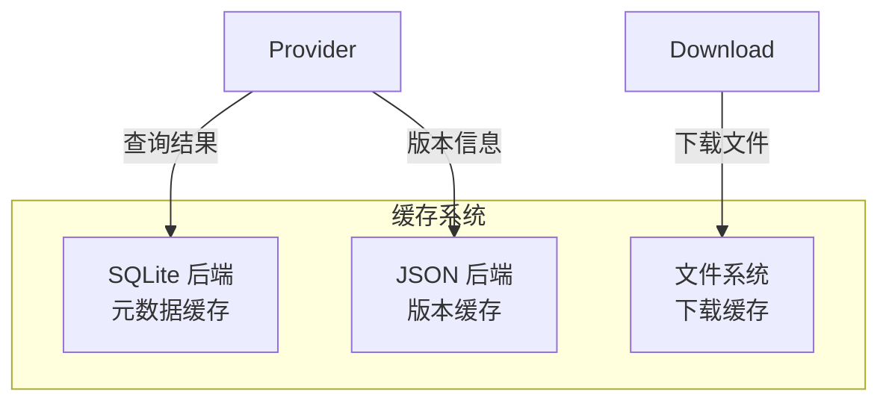

# 数据模型

CogniaLauncher 的数据存储设计涵盖缓存系统、配置管理和状态持久化。

---

## 缓存架构

### 双后端设计



### SQLite 缓存

存储结构化元数据：

- 包信息（名称、版本、描述、依赖）
- 搜索结果
- Provider 状态
- 下载历史

### JSON 缓存

轻量级版本数据：

- 前端版本检测结果
- 配置快照
- 用户偏好

### 文件缓存

已下载的二进制文件和安装包，支持：

- 校验和验证（SHA256）
- 过期清理
- 磁盘空间管理

---

## 配置系统

### 配置文件格式

```toml
# ~/.CogniaLauncher/config/config.toml

[general]
parallel_downloads = 4
resolve_strategy = "latest"

[network]
timeout = 30
retries = 3

[mirrors]
[mirrors.npm]
url = "https://registry.npmmirror.com"
```

### 设置结构

```rust
pub struct Settings {
    pub general: GeneralSettings,
    pub network: NetworkSettings,
    pub mirrors: HashMap<String, MirrorConfig>,
    pub providers: HashMap<String, ProviderSettings>,
    pub appearance: AppearanceSettings,
    pub security: SecuritySettings,
    pub cache: CacheSettings,
}
```

---

## 前端状态

### Zustand Store 数据模型

**appearance.ts**
```typescript
interface AppearanceState {
  mode: "light" | "dark" | "system"
  accentColor: string
  chartColorTheme: ChartColorTheme
}
```

**dashboard.ts**
```typescript
interface DashboardState {
  widgetOrder: string[]
  hiddenWidgets: string[]
}
```

**download.ts**
```typescript
interface DownloadState {
  tasks: DownloadTask[]
  speedLimit: number
  maxConcurrent: number
}
```

**log.ts**
```typescript
interface LogState {
  entries: LogEntry[]
  filter: LogFilter
  page: number
  pageSize: number
}
```

所有 Store 通过 `persist` 中间件序列化到 `localStorage`。

---

## 核心数据类型

### Provider 数据

| 类型 | 用途 |
|------|------|
| `PackageInfo` | 包详细信息 |
| `InstalledPackage` | 已安装的包 |
| `SearchResult` | 搜索结果 |
| `InstallReceipt` | 安装回执 |
| `UpdateInfo` | 可用更新 |
| `ProgressInfo` | 进度信息 |
| `InstalledVersion` | 已安装版本详情 |

### 环境数据

| 类型 | 用途 |
|------|------|
| `EnvironmentInfo` | 环境详情 |
| `EnvModification` | 环境变量修改 |
| `VersionAlias` | 版本别名 |
| `DetectionRule` | 自定义检测规则 |

### 下载数据

| 类型 | 用途 |
|------|------|
| `DownloadTask` | 下载任务 |
| `QueueStats` | 队列统计 |
| `VerifyResult` | 校验和验证结果 |
| `DownloadHistory` | 下载历史记录 |
