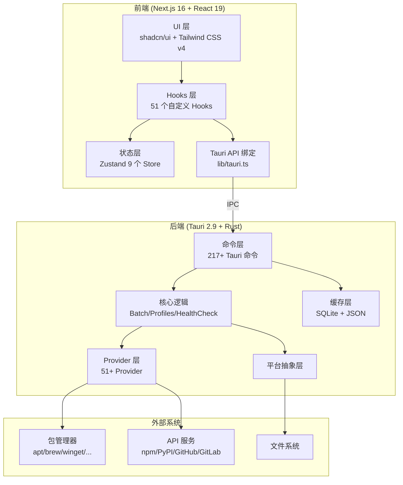
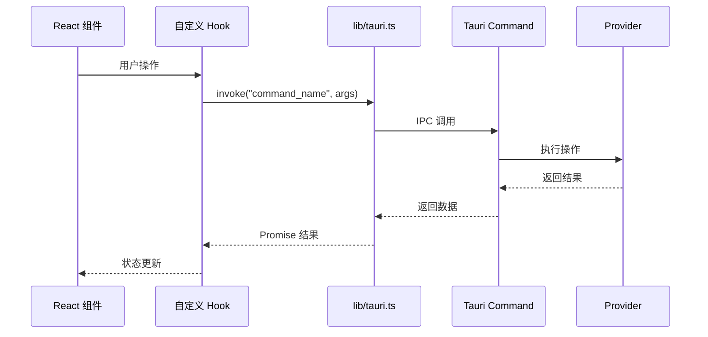

# 架构总览

CogniaLauncher 采用 **混合 Web/桌面** 架构，前端使用 Next.js 静态导出，后端使用 Tauri (Rust) 提供原生桌面能力。

---

## 系统架构图



---

## 分层架构

### 前端层

| 层级 | 职责 | 关键技术 |
|------|------|----------|
| UI 层 | 用户界面渲染 | React 19, shadcn/ui, Tailwind CSS v4 |
| Hooks 层 | 业务逻辑封装 | 51 个自定义 Hooks |
| 状态层 | 全局状态管理 | Zustand 5（localStorage 持久化） |
| API 绑定层 | Tauri IPC 通信 | `@tauri-apps/api` |

### 后端层

| 层级 | 职责 | 关键技术 |
|------|------|----------|
| 命令层 | IPC 接口定义 | Tauri `#[tauri::command]` |
| 核心层 | 业务编排 | 批量操作、配置快照、健康检查 |
| Provider 层 | 包管理器抽象 | 51+ Provider 实现 |
| 缓存层 | 数据缓存 | SQLite + JSON 双后端 |
| 平台层 | OS 抽象 | 文件系统、进程、网络 |

---

## 通信模型

前后端通过 Tauri IPC（Inter-Process Communication）通信：



### 事件系统

后端可通过 Tauri 事件系统向前端推送实时数据：

- `env-install-progress` — 环境安装进度
- `download-task-*` — 下载任务状态变化
- `self-update-progress` — 自更新进度
- `update-check-progress` — 更新检查进度

---

## 关键设计决策

### 静态导出

生产构建使用 `output: "export"`，生成纯静态文件。这意味着：

- ❌ 无服务端 API 路由
- ❌ 无 SSR/ISR
- ✅ 可直接打包进 Tauri
- ✅ 可部署到任何静态托管

### Tauri 集成守卫

所有 Tauri API 调用使用 `isTauri()` 守卫，确保 Web 模式下优雅降级：

```typescript
if (isTauri()) {
  const result = await invoke("command_name", args);
} else {
  // Web 模式下的 fallback
}
```

### 状态持久化

所有 Zustand Store 使用 `persist` 中间件，数据保存在 `localStorage` 中，实现跨会话状态保持。

---

## 模块索引

### 前端模块

| 目录 | 内容 | 数量 |
|------|------|------|
| `app/` | 页面路由 | 10 个页面 |
| `components/` | React 组件 | 10+ 子目录 |
| `hooks/` | 自定义 Hooks | 51 个 |
| `lib/stores/` | Zustand Stores | 9 个 |
| `lib/theme/` | 主题系统 | 4 个文件 |
| `lib/constants/` | 常量 | 4 个文件 |
| `messages/` | i18n | 2 个语言 (1640+ 键) |
| `types/` | 类型定义 | 6 个文件 |

### 后端模块

| 目录 | 内容 | 数量 |
|------|------|------|
| `src/commands/` | Tauri 命令 | 20 个模块 (217+ 命令) |
| `src/provider/` | Provider 实现 | 54 个文件 (51+ Provider) |
| `src/core/` | 核心逻辑 | 10 个模块 |
| `src/cache/` | 缓存系统 | 多个模块 |
| `src/config/` | 配置系统 | 设置管理 |
| `src/platform/` | 平台抽象 | 磁盘/进程/网络 |
| `src/resolver/` | 依赖解析 | PubGrub 算法 |
