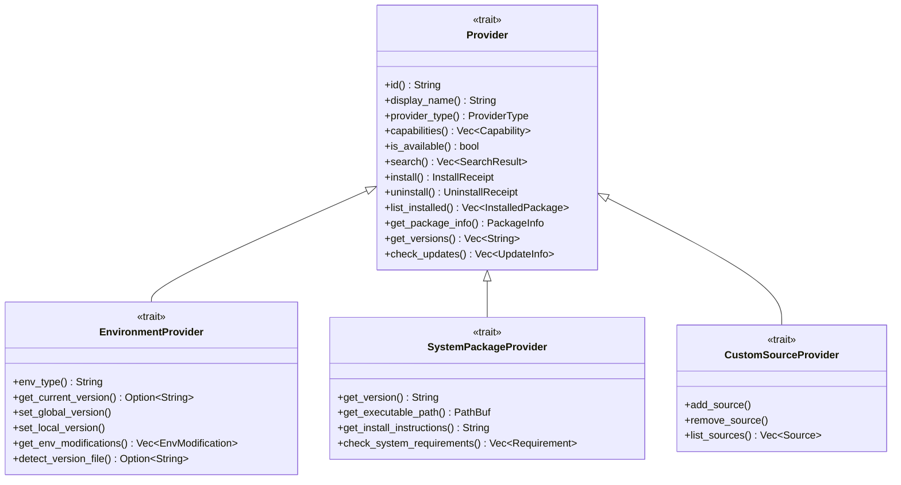
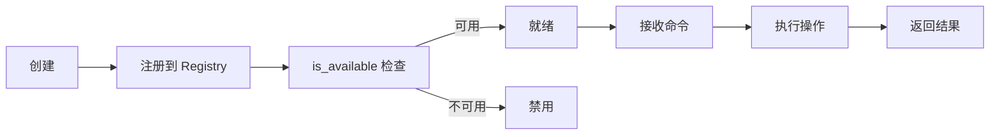

# Provider 系统架构

Provider 是 CogniaLauncher 的核心扩展机制，每个 Provider 封装一个包管理器或版本管理器的完整交互逻辑。

---

## 特质体系



### Provider 特质

基础特质，所有 Provider 必须实现：

- **元数据**：ID、名称、类型、平台、优先级
- **能力声明**：Install、Uninstall、Search、List、Update 等
- **可用性检查**：检测包管理器是否已安装
- **核心操作**：搜索、安装、卸载、列出、更新

### EnvironmentProvider 特质

版本管理器扩展（nvm、pyenv、rustup 等）：

- 环境类型标识
- 版本切换（全局/项目级）
- 环境变量修改
- 版本文件检测

### SystemPackageProvider 特质

系统级信息：

- 可执行文件路径
- 安装说明
- 系统要求检查

---

## 注册机制

Provider 通过 `ProviderRegistry` 统一注册和管理：

```rust
// registry.rs
pub struct ProviderRegistry {
    providers: HashMap<String, Box<dyn Provider>>,
    settings: Arc<RwLock<Settings>>,
}
```

### 注册流程

1. **平台检测** — 根据当前 OS 筛选可用 Provider
2. **条件注册** — 检查包管理器是否安装
3. **优先级排序** — 同类 Provider 按优先级排序
4. **设置集成** — 从配置文件读取启用/禁用状态和镜像地址

### 注册示例

```rust
// Windows 专有 Provider
#[cfg(target_os = "windows")]
{
    registry.register(Box::new(WingetProvider::new()));
    registry.register(Box::new(ScoopProvider::new()));
    registry.register(Box::new(ChocolateyProvider::new()));
}

// 跨平台 Provider
registry.register(Box::new(NpmProvider::new(mirror_config)));
registry.register(Box::new(PipProvider::new(mirror_config)));
```

---

## Provider 生命周期



---

## 进度报告

Provider 操作通过回调函数报告进度：

```rust
pub struct ProgressInfo {
    pub phase: String,        // "downloading", "installing", ...
    pub percentage: Option<f64>,
    pub message: String,
    pub bytes_downloaded: Option<u64>,
    pub bytes_total: Option<u64>,
}
```

进度信息通过 Tauri 事件系统推送到前端。

---

## 镜像支持

Provider 可配置镜像源（通过 `api.rs` 的 `PackageApiClient`）：

- **npm** — 支持 npmmirror 等
- **PyPI** — 支持清华、阿里云等
- **crates.io** — 支持 rsproxy 等
- **Homebrew** — 支持 USTC 等

镜像地址在设置中配置，Provider 初始化时读取。
