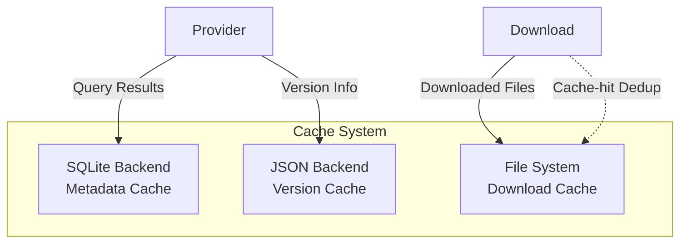

# Data Model

CogniaLauncher's data storage design covers the cache system, configuration management, state persistence, and core domain types.

---

## Cache Architecture

### Triple-Backend Design



### SQLite Cache

Stores structured metadata:

- Package info (name, version, description, dependencies)
- Search results
- Provider state
- Download history records

### JSON Cache

Lightweight version data:

- Frontend version detection results
- Config snapshots
- User preferences

### File Cache

Downloaded binaries and installation packages, supporting:

- Checksum verification (SHA256)
- Expiration cleanup (configurable `cache_max_age_days`)
- Disk space management (configurable `cache_max_size`)
- Auto-clean threshold (triggers cleanup when usage exceeds threshold %)
- Stale partial cleanup (removes incomplete downloads older than 7 days)
- Cache-hit shortcut (completed downloads with checksums are deduplicated)

---

## Configuration System

### Configuration File Format

```toml
# ~/.CogniaLauncher/config/config.toml

[general]
parallel_downloads = 4
resolve_strategy = "latest"       # latest | minimal | locked | prefer-locked
auto_update_metadata = true
metadata_cache_ttl = 3600
cache_max_size = 5368709120       # 5 GB
cache_max_age_days = 30
auto_clean_cache = true
cache_auto_clean_threshold = 80   # percent
cache_monitor_interval = 300      # seconds, 0 = disabled
download_speed_limit = 0          # bytes/sec, 0 = unlimited

[network]
timeout = 30
retries = 3
proxy = ""
no_proxy = ""

[security]
allow_http = false
verify_certificates = true
allow_self_signed = false

[paths]
# root = "/custom/path"
# cache = "/custom/cache"
# environments = "/custom/envs"

[appearance]
theme = "system"                  # light | dark | system
accent_color = "blue"             # zinc | blue | green | purple | orange | rose
chart_color_theme = "default"     # default | vibrant | pastel | ocean | sunset | monochrome
interface_radius = 0.625
interface_density = "comfortable" # compact | comfortable | spacious
language = "en"                   # en | zh
reduced_motion = false

[terminal]
default_shell = "auto"
shell_integration = true
proxy_mode = "global"             # global | none | custom

[mirrors.npm]
url = "https://registry.npmmirror.com"
enabled = true
priority = 0
verify_ssl = true
```

### Settings Structure

```rust
pub struct Settings {
    pub general: GeneralSettings,
    pub network: NetworkSettings,
    pub mirrors: HashMap<String, MirrorConfig>,
    pub providers: HashMap<String, ProviderSettings>,
    pub paths: PathSettings,
    pub security: SecuritySettings,
    pub provider_settings: GlobalProviderSettings,
    pub appearance: AppearanceSettings,
    pub terminal: TerminalSettings,
}
```

Key sub-structs:

| Struct | Fields |
| ------ | ------ |
| `GeneralSettings` | `parallel_downloads`, `resolve_strategy`, `auto_update_metadata`, `metadata_cache_ttl`, `cache_max_size`, `cache_max_age_days`, `auto_clean_cache`, `min_install_space_mb`, `cache_auto_clean_threshold`, `cache_monitor_interval`, `cache_monitor_external`, `download_speed_limit` |
| `NetworkSettings` | `timeout`, `retries`, `proxy`, `no_proxy` |
| `SecuritySettings` | `allow_http`, `verify_certificates`, `allow_self_signed` |
| `PathSettings` | `root`, `cache`, `environments` |
| `AppearanceSettings` | `theme`, `accent_color`, `chart_color_theme`, `interface_radius`, `interface_density`, `language`, `reduced_motion` |
| `TerminalSettings` | `default_shell`, `default_profile_id`, `shell_integration`, `proxy_mode`, `custom_proxy`, `no_proxy` |
| `GlobalProviderSettings` | `pinned_packages`, `disabled_providers` |
| `MirrorConfig` | `url`, `priority`, `enabled`, `verify_ssl` |
| `ProviderSettings` | `enabled`, `priority`, `extra` (flattened key-value) |

---

## Frontend State

### Zustand Store Data Models

All stores use `persist` middleware serialized to `localStorage` (except `window-state` which is ephemeral).

**appearance.ts** — UI appearance preferences (persist v6)

```typescript
interface AppearanceState {
  accentColor: AccentColor
  chartColorTheme: ChartColorTheme
  interfaceRadius: InterfaceRadius
  interfaceDensity: InterfaceDensity
  reducedMotion: boolean
  backgroundEnabled: boolean
  backgroundOpacity: number
  backgroundBlur: number
  backgroundFit: BackgroundFit  // 'cover' | 'contain' | 'fill' | 'tile'
}
```

**dashboard.ts** — Widget layout and customization (persist v2)

```typescript
interface DashboardState {
  widgets: WidgetConfig[]   // 15 widget types: stats-overview, environment-chart,
  isCustomizing: boolean    //   package-chart, cache-usage, activity-timeline,
  isEditMode: boolean       //   system-info, download-stats, quick-search,
}                           //   environment-list, package-list, quick-actions,
                            //   wsl-status, health-check, updates-available, welcome
```

**download.ts** — Download queue, history, and settings

```typescript
interface DownloadState {
  tasks: DownloadTask[]
  stats: QueueStats | null
  history: HistoryRecord[]
  historyStats: HistoryStats | null
  speedLimit: number          // 0 = unlimited
  maxConcurrent: number
  isLoading: boolean
  error: string | null
  selectedTaskIds: Set<string>
  showHistory: boolean
}
```

**log.ts** — Real-time log viewer with filtering

```typescript
interface LogState {
  logs: LogEntry[]
  maxLogs: number             // default 1000
  filter: LogFilter           // levels, search, regex, target, time range
  autoScroll: boolean
  paused: boolean
  drawerOpen: boolean
  logFiles: LogFileInfo[]
  selectedLogFile: string | null
}
```

**environment.ts** — Environment version management

```typescript
interface EnvironmentState {
  environments: EnvironmentInfo[]
  selectedEnv: string | null
  detectedVersions: DetectedEnvironment[]
  availableVersions: Record<string, VersionInfo[]>
  availableProviders: EnvironmentProviderInfo[]
  searchQuery: string
  statusFilter: EnvironmentStatusFilter
  sortBy: EnvironmentSortBy
  viewMode: EnvironmentViewMode
  envSettings: Record<string, EnvironmentSettings>
  installationProgress: InstallationProgress | null
  updateCheckResults: Record<string, EnvUpdateCheckResult>
}
```

**packages.ts** — Package search, install, and update tracking

```typescript
interface PackageState {
  searchResults: PackageSummary[]
  installedPackages: InstalledPackage[]
  selectedPackage: PackageInfo | null
  providers: ProviderInfo[]
  searchQuery: string
  selectedProvider: string | null
  availableUpdates: UpdateInfo[]
  pinnedPackages: string[]
  bookmarkedPackages: string[]
  updateCheckProgress: UpdateCheckProgress | null
  isCheckingUpdates: boolean
}
```

**settings.ts** — App-level settings and platform info

```typescript
interface SettingsState {
  config: Record<string, string>
  cacheInfo: CacheInfo | null
  cacheSettings: CacheSettings | null
  platformInfo: PlatformInfo | null
  cogniaDir: string | null
  appSettings: AppSettings  // checkUpdatesOnStart, minimizeToTray, autostart, trayClickBehavior, etc.
}
```

**onboarding.ts** — First-run wizard and guided tour (persist v2)

```typescript
interface OnboardingState {
  completed: boolean
  skipped: boolean
  currentStep: number         // 7 steps: welcome → language → theme → environment-detection → mirrors → shell-init → complete
  wizardOpen: boolean
  tourCompleted: boolean
  tourActive: boolean
  dismissedHints: string[]
  hintsEnabled: boolean
}
```

**changelog.ts** — What's New dialog tracking

```typescript
interface ChangelogState {
  lastSeenVersion: string
  whatsNewOpen: boolean
}
```

**window-state.ts** — Desktop window state (ephemeral, no persist)

```typescript
interface WindowStateStore {
  isMaximized: boolean
  isFullscreen: boolean
  isFocused: boolean
  titlebarHeight: string
}
```

---

## Core Data Types

### Provider Data

| Type | Purpose |
| ------ | ------- |
| `PackageSummary` | Lightweight search result (name, description, latest version, provider) |
| `PackageInfo` | Full package details (name, display name, description, homepage, license, repository, versions) |
| `VersionInfo` | Version entry with release date, deprecated/yanked flags |
| `InstalledPackage` | Installed package (name, version, provider, install path, timestamp, global flag) |
| `InstallReceipt` | Install receipt (name, version, provider, install path, files, timestamp) |
| `InstallRequest` | Install parameters (name, version, global, force) |
| `UninstallRequest` | Uninstall parameters (name, version, force) |
| `UpdateInfo` | Available update (name, current version, latest version, provider) |
| `ProviderStatus` | Provider availability (id, display name, installed, version, executable path) |
| `InstalledVersion` | Version manager entry (version, install path, size, timestamp, is current) |
| `InstallProgressEvent` | Detailed install progress (stage, package, bytes, speed, percent, message) |

### Environment Data

| Type | Purpose |
| ------ | ------- |
| `EnvironmentInfo` | Environment details (type, current version, providers, installed versions) |
| `EnvModifications` | Environment variable modifications for version activation |
| `VersionDetection` | Detected version with source (local file, manifest, global, system executable) |
| `CustomDetectionRule` | User-defined detection rules for environment version detection |
| `InstalledVersion` | Installed version entry with path, size, timestamp, and current flag |

### Download Data

| Type | Purpose |
| ------ | ------- |
| `DownloadTask` | Download task with full metadata (URL, state, progress, retry count, checksum) |
| `QueueStats` | Queue statistics (total, queued, downloading, paused, completed, failed, speed, ETA) |
| `VerifyResult` | File checksum verification result (valid, actual checksum, expected checksum) |
| `DownloadHistory` | Download history storage with records and statistics |

### Custom Source Data

| Type | Purpose |
| ------ | ------- |
| `ReleaseInfo` | Release metadata (version, tag, published date, prerelease, assets) |
| `AssetInfo` | Release asset (name, URL, size, content type) |
| `ArtifactInfo` | Resolved download artifact (URL, filename, size, checksum) |

### Provider Trait Hierarchy

```text
Provider (base)
├── EnvironmentProvider — version management (list, switch, detect, env modifications)
├── SystemPackageProvider — system package managers (elevation, status, update index, upgrade)
└── CustomSourceProvider — GitHub/GitLab releases (fetch releases, resolve artifacts, download)
```

Capabilities: `Install`, `Uninstall`, `Update`, `Upgrade`, `Search`, `List`, `LockVersion`, `Rollback`, `VersionSwitch`, `MultiVersion`, `ProjectLocal`, `UpdateIndex`
