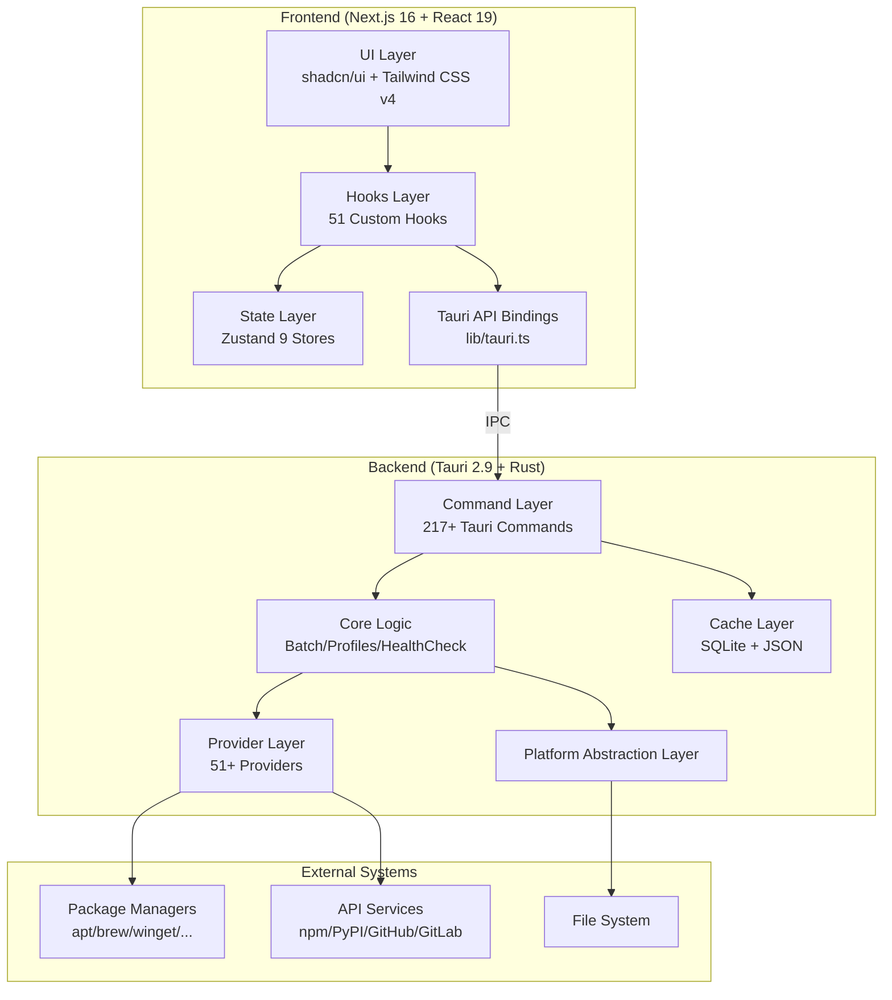
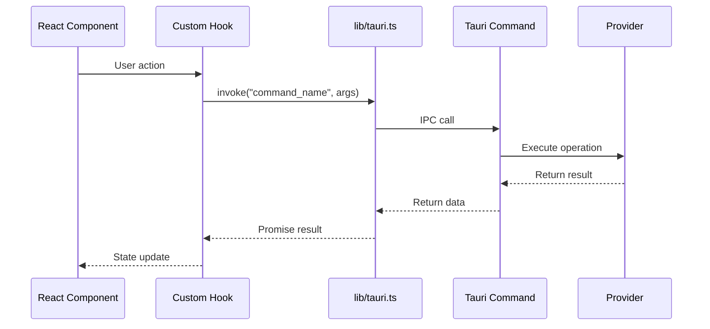

# Architecture Overview

CogniaLauncher uses a **hybrid Web/desktop** architecture, with the frontend using Next.js static export and the backend using Tauri (Rust) for native desktop capabilities.

---

## System Architecture Diagram



---

## Layered Architecture

### Frontend Layers

| Layer | Responsibility | Key Technology |
|-------|---------------|----------------|
| UI Layer | User interface rendering | React 19, shadcn/ui, Tailwind CSS v4 |
| Hooks Layer | Business logic encapsulation | 51 custom Hooks |
| State Layer | Global state management | Zustand 5 (localStorage persistence) |
| API Binding Layer | Tauri IPC communication | `@tauri-apps/api` |

### Backend Layers

| Layer | Responsibility | Key Technology |
|-------|---------------|----------------|
| Command Layer | IPC interface definitions | Tauri `#[tauri::command]` |
| Core Layer | Business orchestration | Batch ops, config snapshots, health checks |
| Provider Layer | Package manager abstraction | 51+ Provider implementations |
| Cache Layer | Data caching | SQLite + JSON dual backend |
| Platform Layer | OS abstraction | File system, process, network |

---

## Communication Model

Frontend and backend communicate via Tauri IPC (Inter-Process Communication):



### Event System

The backend can push real-time data to the frontend via the Tauri event system:

- `env-install-progress` — Environment installation progress
- `download-task-*` — Download task status changes
- `self-update-progress` — Self-update progress
- `update-check-progress` — Update check progress

---

## Key Design Decisions

### Static Export

Production builds use `output: "export"`, generating purely static files. This means:

- ❌ No server-side API routes
- ❌ No SSR/ISR
- ✅ Can be bundled directly into Tauri
- ✅ Can be deployed to any static hosting

### Tauri Integration Guard

All Tauri API calls use an `isTauri()` guard to ensure graceful degradation in Web mode:

```typescript
if (isTauri()) {
  const result = await invoke("command_name", args);
} else {
  // Fallback for Web mode
}
```

### State Persistence

All Zustand Stores use the `persist` middleware, saving data to `localStorage` for cross-session state persistence.

---

## Module Index

### Frontend Modules

| Directory | Contents | Count |
|-----------|----------|-------|
| `app/` | Page routes | 10 pages |
| `components/` | React components | 10+ subdirectories |
| `hooks/` | Custom Hooks | 51 |
| `lib/stores/` | Zustand Stores | 9 |
| `lib/theme/` | Theme system | 4 files |
| `lib/constants/` | Constants | 4 files |
| `messages/` | i18n | 2 languages (1640+ keys) |
| `types/` | Type definitions | 6 files |

### Backend Modules

| Directory | Contents | Count |
|-----------|----------|-------|
| `src/commands/` | Tauri commands | 20 modules (217+ commands) |
| `src/provider/` | Provider implementations | 54 files (51+ Providers) |
| `src/core/` | Core logic | 10 modules |
| `src/cache/` | Cache system | Multiple modules |
| `src/config/` | Configuration system | Settings management |
| `src/platform/` | Platform abstraction | Disk/process/network |
| `src/resolver/` | Dependency resolution | PubGrub algorithm |
