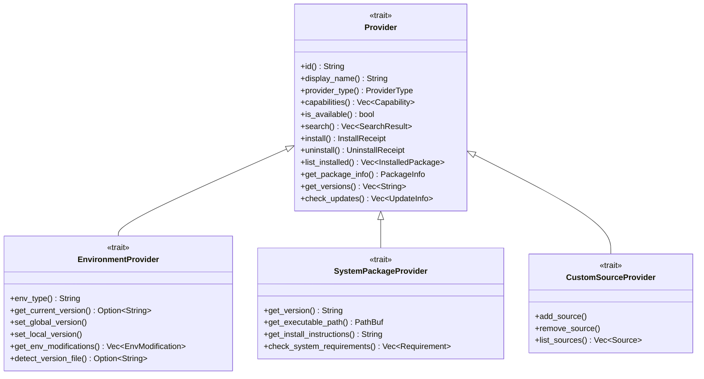
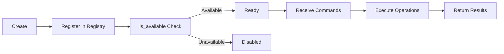

# Provider System Architecture

Providers are the core extension mechanism of CogniaLauncher. Each Provider encapsulates the complete interaction logic for a package manager or version manager.

---

## Trait Hierarchy



### Provider Trait

Base trait that all Providers must implement:

- **Metadata**: ID, name, type, platform, priority
- **Capability Declaration**: Install, Uninstall, Search, List, Update, etc.
- **Availability Check**: Detect if the package manager is installed
- **Core Operations**: Search, install, uninstall, list, update

### EnvironmentProvider Trait

Version manager extension (nvm, pyenv, rustup, etc.):

- Environment type identifier
- Version switching (global/project-level)
- Environment variable modifications
- Version file detection

### SystemPackageProvider Trait

System-level information:

- Executable file path
- Installation instructions
- System requirements check

---

## Registration Mechanism

Providers are registered and managed through `ProviderRegistry`:

```rust
// registry.rs
pub struct ProviderRegistry {
    providers: HashMap<String, Box<dyn Provider>>,
    settings: Arc<RwLock<Settings>>,
}
```

### Registration Flow

1. **Platform Detection** — Filter available Providers based on current OS
2. **Conditional Registration** — Check if the package manager is installed
3. **Priority Sorting** — Sort same-category Providers by priority
4. **Settings Integration** — Read enable/disable status and mirror URLs from config

### Registration Example

```rust
// Windows-specific Providers
#[cfg(target_os = "windows")]
{
    registry.register(Box::new(WingetProvider::new()));
    registry.register(Box::new(ScoopProvider::new()));
    registry.register(Box::new(ChocolateyProvider::new()));
}

// Cross-platform Providers
registry.register(Box::new(NpmProvider::new(mirror_config)));
registry.register(Box::new(PipProvider::new(mirror_config)));
```

---

## Provider Lifecycle



---

## Progress Reporting

Provider operations report progress via callback functions:

```rust
pub struct ProgressInfo {
    pub phase: String,        // "downloading", "installing", ...
    pub percentage: Option<f64>,
    pub message: String,
    pub bytes_downloaded: Option<u64>,
    pub bytes_total: Option<u64>,
}
```

Progress information is pushed to the frontend via the Tauri event system.

---

## Mirror Support

Providers can be configured with mirror sources (via `api.rs`'s `PackageApiClient`):

- **npm** — Supports npmmirror, etc.
- **PyPI** — Supports Tsinghua, Alibaba Cloud, etc.
- **crates.io** — Supports rsproxy, etc.
- **Homebrew** — Supports USTC, etc.

Mirror URLs are configured in settings and read during Provider initialization.
