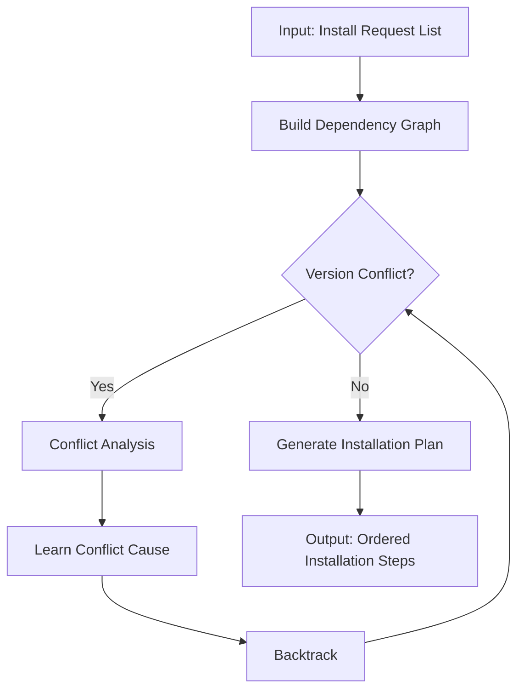
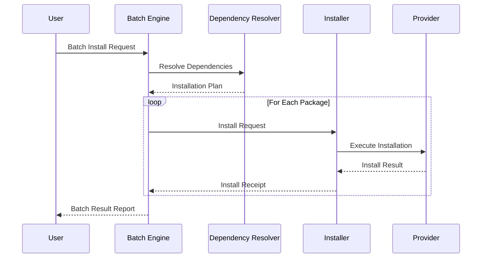
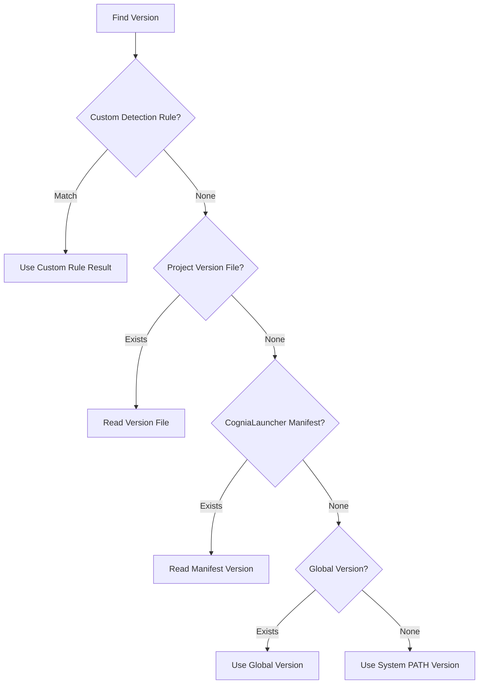
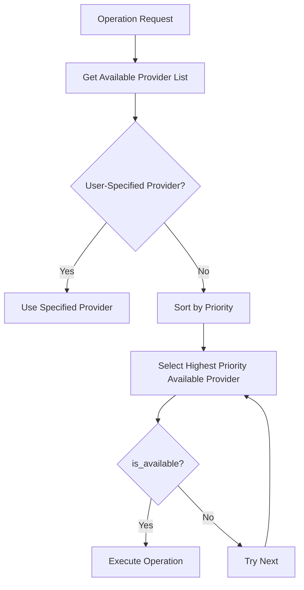

# Software Design

This document records the core design philosophy and key algorithms of CogniaLauncher.

---

## Dependency Resolution Algorithm

CogniaLauncher uses the **PubGrub** algorithm for dependency resolution:

### Core Features

- **Completeness** — Guarantees finding a solution or proving none exists
- **Incremental** — Progressively adds constraints
- **Conflict Learning** — Avoids re-exploring the same conflict paths
- **Human-Readable Errors** — Generates understandable error messages on conflict

---

## Installation Orchestration

Multi-package installation uses an Orchestrator to coordinate:

### Installation Order

1. Topologically sort the dependency graph
2. Packages without dependencies can be installed in parallel
3. Packages with dependencies are installed in dependency order
4. A single package failure does not block unrelated packages

---

## Version Detection Priority

### Custom Detection

Supports 9 extraction strategies:

| Strategy | Description | Example |
|----------|-------------|---------|
| Regex | Extract from text | `(\d+\.\d+\.\d+)` |
| JSON Path | Extract from JSON | `$.engines.node` |
| TOML Field | Extract from TOML | `tool.python.version` |
| YAML Path | Extract from YAML | `runtime.version` |
| Line Number | Extract from specific line | Line 3 |
| Environment Variable | Read env variable | `NODE_VERSION` |
| Command Output | Execute command to extract | `node --version` |
| Filename | Extract from filename | `python-3.11.tar.gz` |
| Fixed Value | Use a fixed version | `20.0.0` |

---

## Provider Selection Algorithm

Selection logic when multiple Providers are available for the same operation:

---

## Health Check System

The health check system diagnoses environment and system issues:

1. **Environment Check** — Version file consistency, PATH configuration
2. **System Check** — Disk space, network connectivity
3. **Provider Check** — Provider availability, configuration correctness
4. **Fix Suggestions** — Generates fix actions for each issue

---

## Config Snapshots (Profiles)

The Profiles system manages environment configuration snapshots:

- **Create Snapshot** — Record all current environment versions
- **Restore Snapshot** — Batch switch to versions in the snapshot
- **Export/Import** — Share environment configuration across machines
- **Compare** — Diff two snapshots
