# 统一环境与包管理器 (CogniaLauncher) 软件设计文档

---

## 文档控制信息

| 项目 | 内容 |
|------|------|
| 文档标题 | 统一环境与包管理器 (CogniaLauncher) 软件设计文档 |
| 文档编号 | CogniaLauncher-SDD-2026-001 |
| 版本号 | 1.0.0 |
| 状态 | 草案 |
| 作者 | Max Qian |
| 创建日期 | 2026-01-12 |
| 最后更新 | 2026-01-12 |

### 修订历史

| 版本 | 日期 | 作者 | 修订内容 |
|------|------|------|----------|
| 0.1.0 | 2026-01-10 | - | 初始草案 |
| 0.2.0 | 2026-01-11 | - | 添加Provider详细设计 |
| 1.0.0 | 2026-01-12 | - | 完成评审，正式发布 |

### 文档审批

| 角色 | 姓名 | 签名 | 日期 |
|------|------|------|------|
| 架构师 | | | |
| 技术负责人 | | | |
| 项目经理 | | | |

---

## 目录

1. [引言](#1-引言)
2. [系统概述](#2-系统概述)
3. [架构设计](#3-架构设计)
4. [详细设计](#4-详细设计)
5. [数据设计](#5-数据设计)
6. [接口设计](#6-接口设计)
7. [错误处理设计](#7-错误处理设计)
8. [安全性设计](#8-安全性设计)
9. [设计难点与解决方案](#9-设计难点与解决方案)
10. [实现难点与技术风险](#10-实现难点与技术风险)
11. [测试策略](#11-测试策略)
12. [部署设计](#12-部署设计)
13. [附录](#13-附录)

---

## 1. 引言

### 1.1 目的

本文档为统一环境与包管理器（CogniaLauncher）提供完整的软件设计说明。本文档的目标读者包括：

- 软件开发工程师：理解系统架构和实现细节
- 测试工程师：理解系统行为以设计测试用例
- 运维工程师：理解部署和配置要求
- 项目管理人员：评估技术复杂度和风险

### 1.2 范围

本文档涵盖 CogniaLauncher 系统的以下方面：

- 系统整体架构设计
- 核心模块的详细设计
- 数据模型与存储设计
- 内部与外部接口设计
- 扩展机制设计
- 跨平台适配策略

### 1.3 定义、缩写与术语

| 术语 | 定义 |
|------|------|
| Provider | 包或环境的提供者抽象，负责与具体包管理器交互 |
| Environment | 特定版本运行时的隔离环境（如 Node.js 18.x） |
| Package | 可安装的软件单元 |
| Artifact | 包的可下载制品（二进制、压缩包等） |
| Manifest | 项目依赖声明文件 |
| Lockfile | 依赖锁定文件，记录精确版本 |
| Resolution | 依赖解析过程 |
| SAT | Boolean Satisfiability Problem，布尔可满足性问题 |

### 1.4 参考文档

| 编号 | 文档名称 | 版本 |
|------|----------|------|
| REF-001 | CogniaLauncher 产品需求文档 | 1.0 |
| REF-002 | Semantic Versioning 2.0.0 | 2.0.0 |
| REF-003 | PubGrub 算法论文 | - |
| REF-004 | TOML 规范 | 1.0.0 |

### 1.5 文档概览


---

## 2. 系统概述

### 2.1 系统背景

现代软件开发环境面临以下挑战：

1. **环境碎片化**：开发者需要管理多种语言运行时（Node.js、Python、Rust 等）
2. **工具分散**：每种环境有独立的版本管理工具（nvm、pyenv、rustup）
3. **系统包管理差异**：不同操作系统使用不同的包管理器
4. **自定义软件分发困难**：内部工具或小众软件缺乏统一安装方式

### 2.2 系统目标

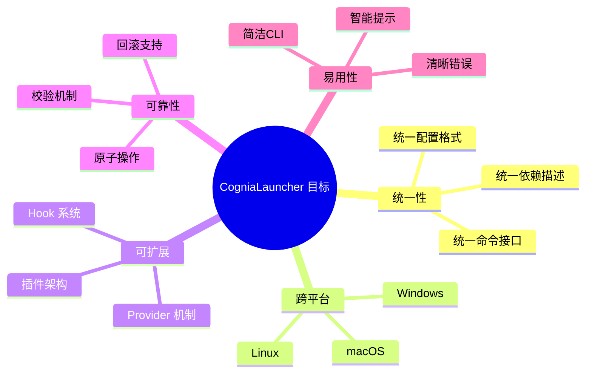

### 2.3 系统边界

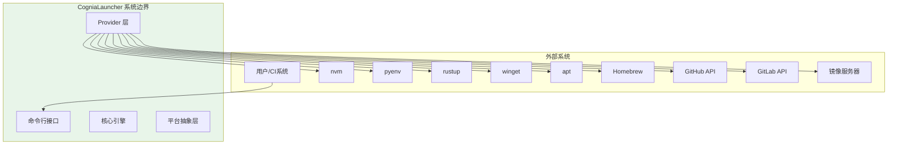

### 2.4 用户角色

| 角色 | 描述 | 主要用例 |
|------|------|----------|
| 开发者 | 日常使用 CogniaLauncher 管理开发环境 | 安装环境、管理依赖、切换版本 |
| DevOps 工程师 | 在 CI/CD 中使用 CogniaLauncher | 自动化环境配置、一致性保证 |
| 系统管理员 | 为团队配置和维护 CogniaLauncher | 配置镜像、管理策略、审计 |
| 插件开发者 | 扩展 CogniaLauncher 功能 | 开发新 Provider、集成新工具 |

### 2.5 约束条件

| 类别 | 约束 | 影响 |
|------|------|------|
| 技术约束 | 必须支持离线模式 | 需要本地缓存机制 |
| 技术约束 | 不能要求管理员权限（用户态安装） | 限制某些系统级操作 |
| 业务约束 | 必须兼容现有工具 | 不能破坏已有配置 |
| 资源约束 | 内存占用 < 100MB | 限制缓存策略 |

---

## 3. 架构设计

### 3.1 架构原则

| 原则 | 描述 | 实践 |
|------|------|------|
| 单一职责 | 每个模块只负责一项功能 | Provider 只处理特定包管理器 |
| 开闭原则 | 对扩展开放，对修改关闭 | 通过接口扩展新 Provider |
| 依赖倒置 | 依赖抽象而非具体实现 | Core 依赖 Provider 接口 |
| 接口隔离 | 接口应该小而专注 | 分离 Provider、EnvironmentProvider |
| 最小惊讶 | 行为应符合用户预期 | 命令语义与常见工具一致 |

### 3.2 架构风格

本系统采用**分层架构 + 插件架构**的混合架构风格。

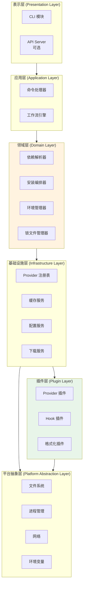

### 3.3 模块分解

#### 3.3.1 模块结构图

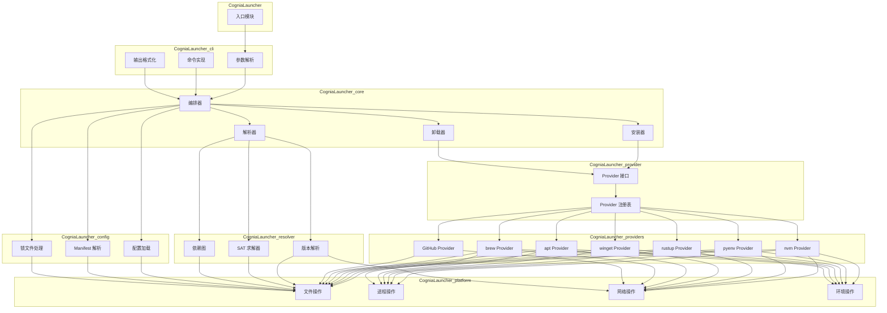

#### 3.3.2 模块职责说明

| 模块 | 职责 | 依赖 |
|------|------|------|
| CogniaLauncher-cli | 命令行解析、用户交互、输出格式化 | CogniaLauncher-core |
| CogniaLauncher-core | 业务逻辑编排、安装/卸载流程控制 | CogniaLauncher-provider, CogniaLauncher-resolver, CogniaLauncher-config |
| CogniaLauncher-provider | Provider 抽象接口定义与注册管理 | CogniaLauncher-platform |
| CogniaLauncher-resolver | 依赖解析、版本约束求解 | CogniaLauncher-platform |
| CogniaLauncher-config | 配置文件和锁文件的读写解析 | CogniaLauncher-platform |
| CogniaLauncher-platform | 跨平台操作系统 API 封装 | 无（底层模块） |

### 3.4 运行时架构

#### 3.4.1 进程模型

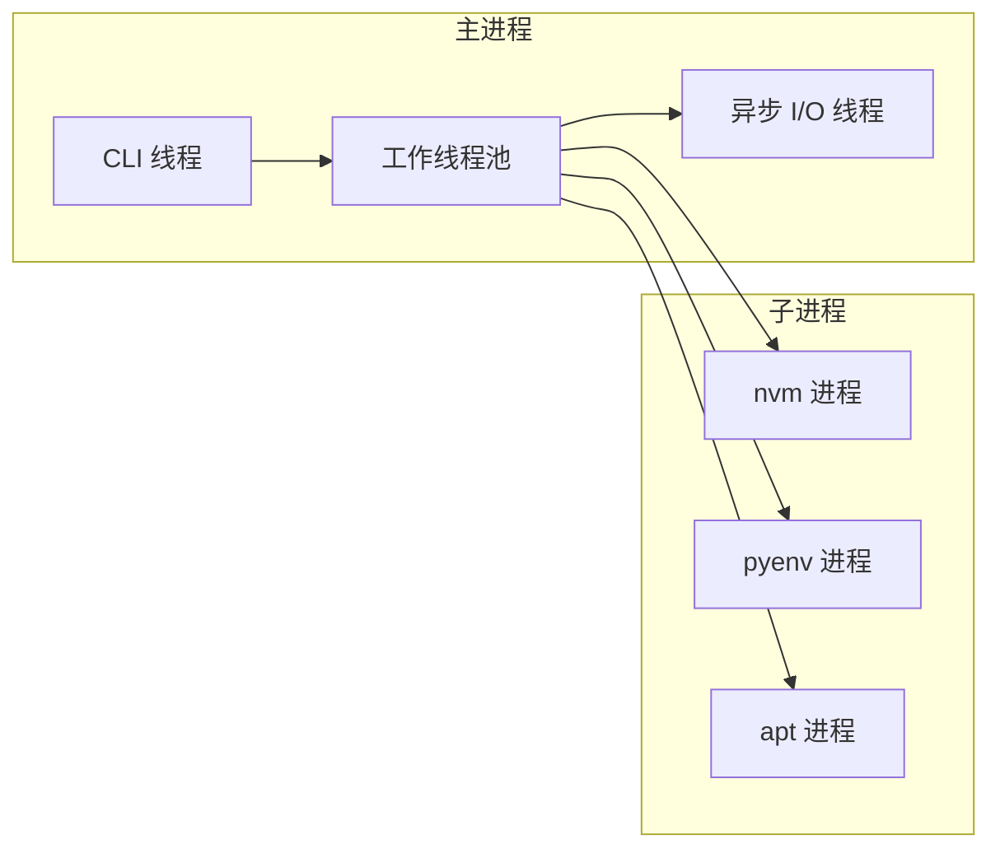

#### 3.4.2 并发模型

| 操作类型 | 并发策略 | 原因 |
|----------|----------|------|
| 元数据获取 | 并行（多线程） | I/O 密集，可并行加速 |
| 依赖解析 | 串行 | CPU 密集，需要全局状态 |
| 包下载 | 并行（受限） | 带宽限制，需控制并发数 |
| 包安装 | 串行/受控并行 | 避免文件系统冲突 |

### 3.5 部署架构

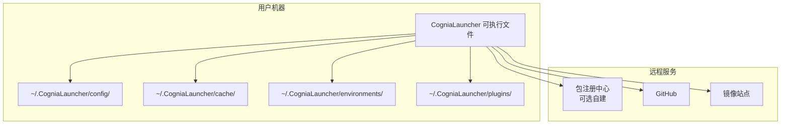

---

## 4. 详细设计

### 4.1 CLI 模块设计

#### 4.1.1 命令层次结构

```
CogniaLauncher
├── install <package>[@version]     # 安装包或环境
├── uninstall <package>             # 卸载包或环境
├── update [package]                # 更新包
├── list [--installed|--available]  # 列出包
├── search <query>                  # 搜索包
├── info <package>                  # 显示包信息
│
├── env                             # 环境管理子命令
│   ├── list                        # 列出环境
│   ├── use <env>@<version>         # 切换环境版本
│   ├── current                     # 显示当前环境
│   └── create <name>               # 创建隔离环境
│
├── config                          # 配置管理
│   ├── get <key>
│   ├── set <key> <value>
│   └── list
│
├── provider                        # Provider 管理
│   ├── list
│   ├── enable <provider>
│   └── disable <provider>
│
├── cache                           # 缓存管理
│   ├── clean
│   └── info
│
└── self                            # 自身管理
    ├── update
    └── uninstall
```

#### 4.1.2 命令处理流程

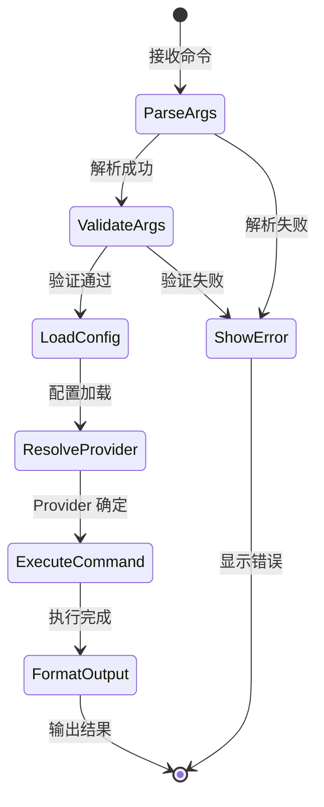

#### 4.1.3 输出格式设计

| 格式 | 用途 | 示例场景 |
|------|------|----------|
| Human | 默认，人类可读 | 交互式终端 |
| JSON | 机器可读 | 脚本集成 |
| YAML | 机器可读 | 配置导出 |
| Quiet | 仅错误输出 | CI 环境 |

### 4.2 Provider 子系统设计

#### 4.2.1 Provider 类型层次

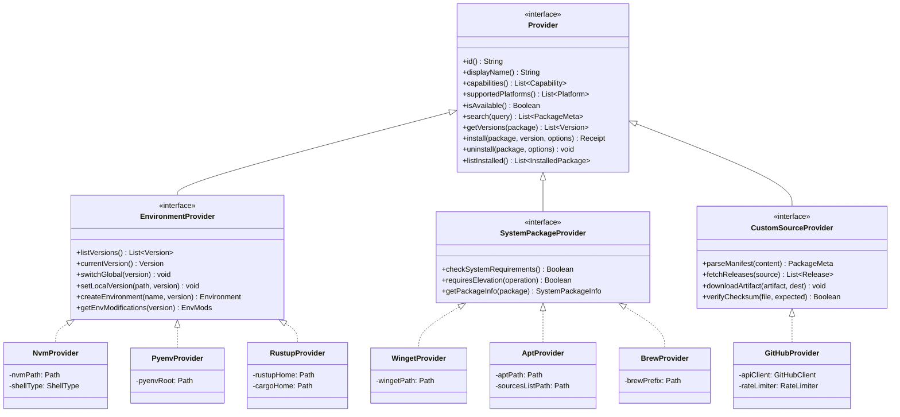

#### 4.2.2 Provider 注册与发现

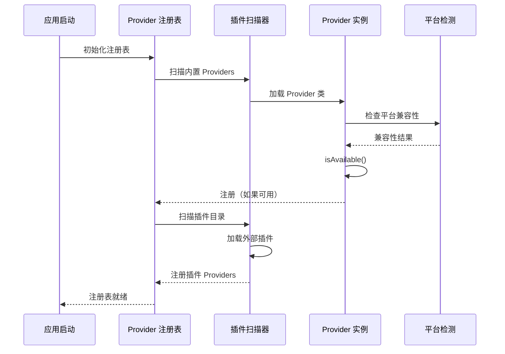

#### 4.2.3 Provider 选择策略

```
算法: SelectProvider(packageName, preferredProvider)

输入:
  - packageName: 包名称
  - preferredProvider: 用户指定的 Provider（可选）

输出:
  - provider: 选中的 Provider 实例

流程:
1. IF preferredProvider 已指定 THEN
     provider = Registry.get(preferredProvider)
     IF provider.supports(packageName) THEN
       RETURN provider
     ELSE
       THROW ProviderNotSupportPackage
     END IF
   END IF

2. candidates = []
   FOR EACH provider IN Registry.all() DO
     IF provider.isAvailable() AND 
        provider.supportedPlatforms().contains(currentPlatform) AND
        provider.canHandle(packageName) THEN
       candidates.append(provider)
     END IF
   END FOR

3. IF candidates.isEmpty() THEN
     THROW NoProviderAvailable
   END IF

4. // 按优先级排序
   candidates.sortBy(p => p.priority(), DESC)

5. // 返回最高优先级的 Provider
   RETURN candidates.first()
```

### 4.3 依赖解析子系统设计

#### 4.3.1 版本约束模型

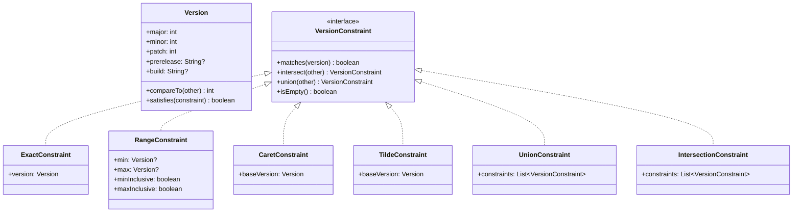

#### 4.3.2 依赖解析算法

```
算法: ResolveDependencies (PubGrub 变体)

输入:
  - rootDeps: 根依赖列表
  - registry: 包注册表（用于查询版本）

输出:
  - solution: Map<PackageName, Version>
  - 或 conflict: 冲突解释

数据结构:
  - partial: Map<PackageName, VersionConstraint>  // 当前部分解
  - incompatibilities: List<Incompatibility>       // 不兼容性集合
  - decisions: Stack<Decision>                     // 决策栈

流程:
1. INITIALIZE partial, incompatibilities, decisions

2. // 添加根依赖
   FOR EACH dep IN rootDeps DO
     partial[dep.name] = dep.constraint
   END FOR

3. LOOP
     // 单元传播
     4. changed = TRUE
        WHILE changed DO
          changed = FALSE
          FOR EACH incompat IN incompatibilities DO
            result = propagate(incompat, partial)
            IF result == CONFLICT THEN
              // 冲突分析与回溯
              newIncompat = analyzeConflict(incompat, decisions)
              IF newIncompat.isTerminal() THEN
                RETURN Failure(explainConflict(newIncompat))
              END IF
              incompatibilities.add(newIncompat)
              backtrack(decisions, partial, newIncompat)
              changed = TRUE
            ELSE IF result == UPDATED THEN
              changed = TRUE
            END IF
          END FOR
        END WHILE

     // 检查是否完成
     5. IF allPackagesDecided(partial) THEN
          RETURN Success(extractSolution(partial))
        END IF

     // 选择下一个要决策的包
     6. package = selectUndecidedPackage(partial)
        versions = registry.getVersions(package)
        versions = filterByConstraint(versions, partial[package])
        
        IF versions.isEmpty() THEN
          // 添加不兼容性并回溯
          incompat = createNoVersionIncompat(package, partial[package])
          incompatibilities.add(incompat)
          CONTINUE
        END IF

     // 做出决策
     7. version = selectVersion(versions, strategy)
        decisions.push(Decision(package, version))
        partial[package] = ExactConstraint(version)
        
        // 添加该版本的依赖
        deps = registry.getDependencies(package, version)
        FOR EACH dep IN deps DO
          IF partial.contains(dep.name) THEN
            partial[dep.name] = partial[dep.name].intersect(dep.constraint)
            IF partial[dep.name].isEmpty() THEN
              // 创建不兼容性
              incompat = createConflictIncompat(package, version, dep)
              incompatibilities.add(incompat)
            END IF
          ELSE
            partial[dep.name] = dep.constraint
          END IF
        END FOR
   END LOOP
```


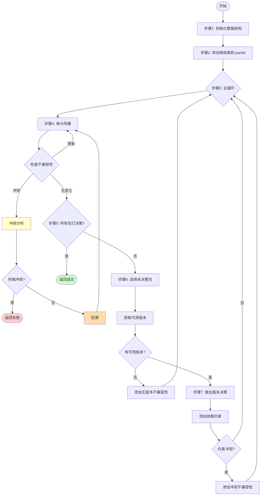

#### 4.3.3 解析策略

| 策略 | 描述 | 适用场景 |
|------|------|----------|
| Latest | 选择满足约束的最新版本 | 新项目、更新依赖 |
| Minimal | 选择满足约束的最低版本 | 保守更新、稳定性优先 |
| Locked | 优先使用锁文件中的版本 | 日常安装、CI 构建 |
| Prefer-Locked | 锁定版本优先，允许更新 | 部分更新 |

### 4.4 安装编排器设计

#### 4.4.1 安装流程状态机

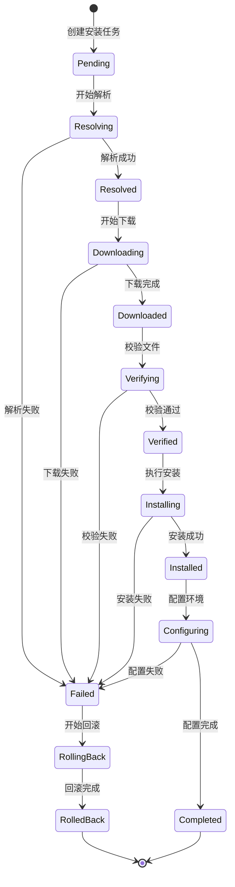

#### 4.4.2 安装编排算法

```
算法: OrchestrateInstall

输入:
  - actions: List<InstallAction>  // 从依赖解析得到的动作列表
  - options: InstallOptions

输出:
  - result: InstallResult

流程:
1. // 构建依赖拓扑图
   graph = buildDependencyGraph(actions)
   sortedActions = topologicalSort(graph)

2. // 初始化状态跟踪
   states = Map<PackageName, InstallState>
   completedActions = []
   
3. // 并行度控制
   semaphore = Semaphore(options.parallelism)
   
4. // 按拓扑顺序处理
   FOR EACH action IN sortedActions DO
     // 等待依赖完成
     waitForDependencies(action, states)
     
     // 获取并行槽
     semaphore.acquire()
     
     // 异步执行
     ASYNC DO
       TRY
         states[action.package] = InProgress
         
         // 下载阶段
         artifact = download(action.artifact, options.progress)
         
         // 校验阶段
         IF NOT verify(artifact, action.checksum) THEN
           THROW ChecksumMismatch
         END IF
         
         // 安装阶段
         provider = Registry.get(action.provider)
         receipt = provider.install(action.package, action.version, options)
         
         // 配置阶段
         configure(action.package, action.version, receipt)
         
         states[action.package] = Completed
         completedActions.append(action)
         
       CATCH error
         states[action.package] = Failed(error)
         IF options.failFast THEN
           SIGNAL abort
         END IF
       FINALLY
         semaphore.release()
       END TRY
     END ASYNC
   END FOR

5. // 等待所有任务完成
   waitAll()

6. // 检查结果
   IF anyFailed(states) THEN
     IF options.rollbackOnFailure THEN
       rollback(completedActions)
     END IF
     RETURN InstallResult.Failed(collectErrors(states))
   END IF

7. // 更新锁文件
   updateLockFile(completedActions)
   
   RETURN InstallResult.Success(completedActions)
```

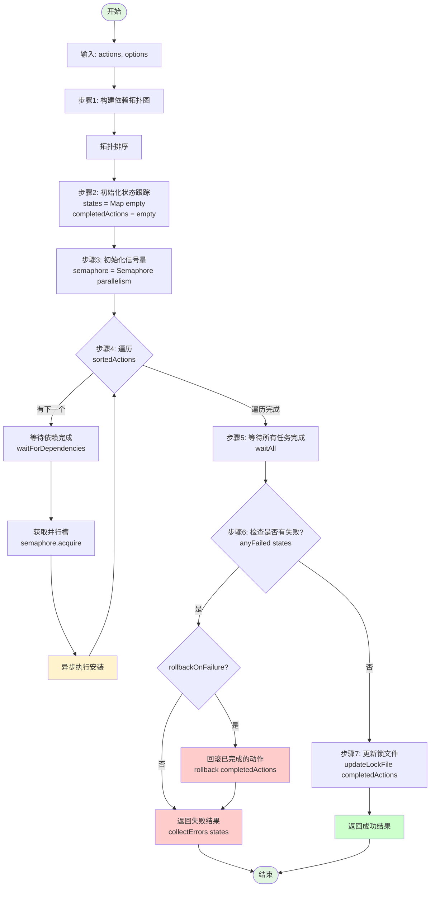

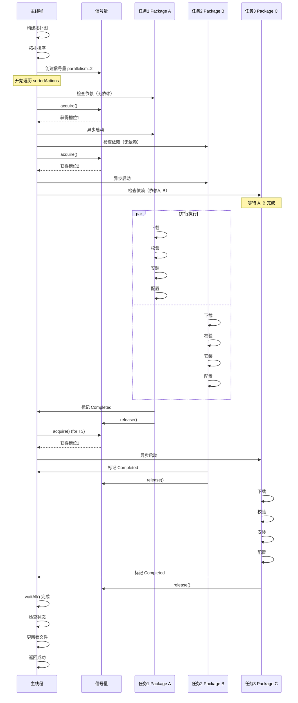
### 4.5 环境管理器设计

#### 4.5.1 环境隔离模型

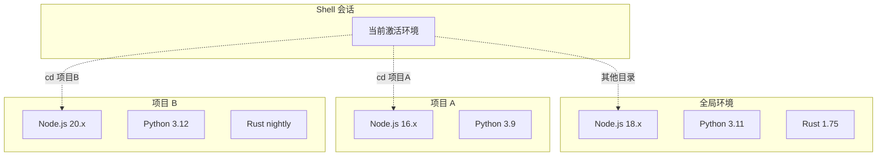

#### 4.5.2 版本切换机制

```
算法: ActivateEnvironment

输入:
  - envType: 环境类型 (node, python, rust, ...)
  - version: 目标版本
  - scope: 作用域 (global, local, session)

输出:
  - envMods: 环境变量修改

流程:
1. provider = Registry.getEnvironmentProvider(envType)
   
2. // 验证版本已安装
   installedVersions = provider.listVersions()
   IF version NOT IN installedVersions THEN
     THROW VersionNotInstalled
   END IF

3. // 获取环境变量修改
   envMods = provider.getEnvModifications(version)
   // envMods 包含:
   //   - PATH 添加/修改
   //   - 环境变量设置 (如 JAVA_HOME, RUSTUP_HOME)
   //   - 环境变量删除

4. SWITCH scope
     CASE global:
       // 修改 shell 配置文件 (.bashrc, .zshrc, etc.)
       updateShellConfig(envMods)
       
       // 写入版本文件
       writeVersionFile(getGlobalVersionFilePath(envType), version)
       
     CASE local:
       // 写入项目本地版本文件
       writeVersionFile(currentDir / getLocalVersionFileName(envType), version)
       // 如 .node-version, .python-version, .rust-toolchain
       
     CASE session:
       // 仅修改当前 shell 会话
       // 输出可被 eval 的 shell 命令
       RETURN generateShellCommands(envMods)
   END SWITCH

5. RETURN envMods
```

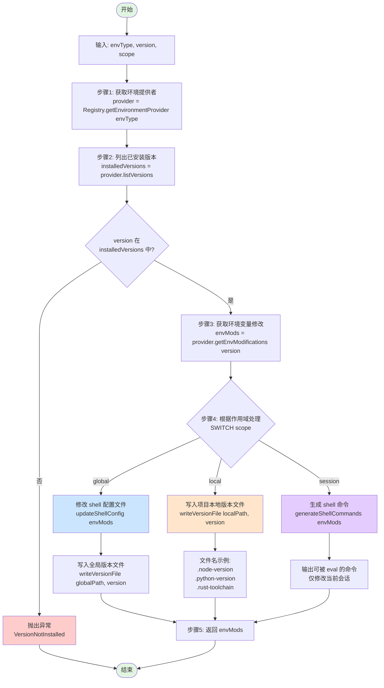

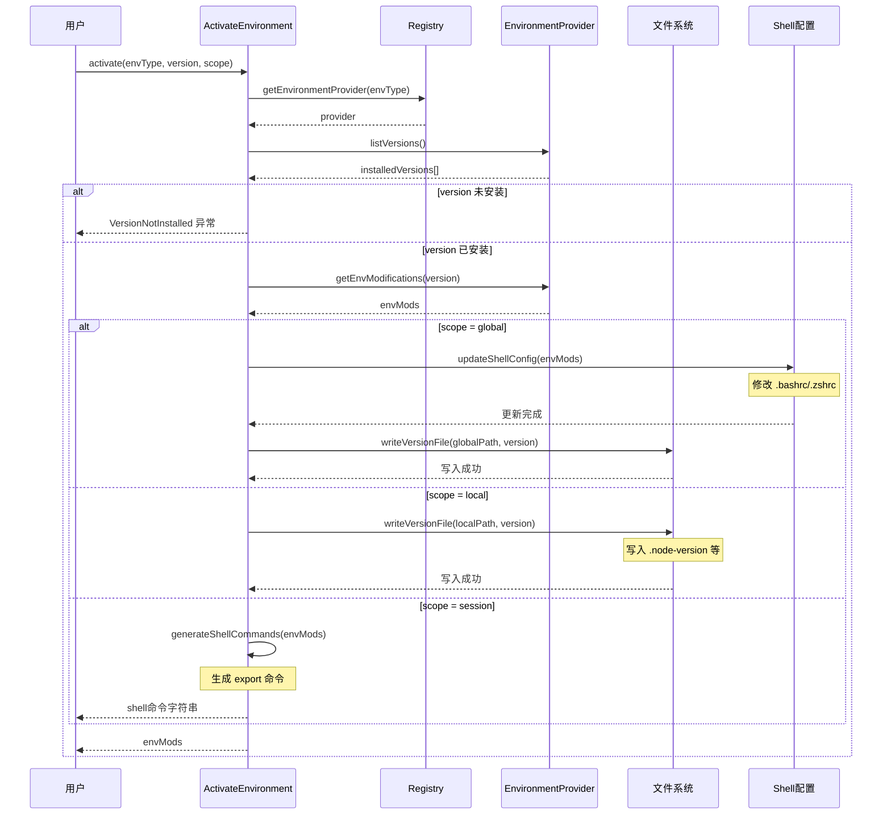
#### 4.5.3 自动版本检测

```
算法: DetectVersion

输入:
  - envType: 环境类型
  - startPath: 起始目录

输出:
  - version: 检测到的版本
  - source: 版本来源

流程:
1. currentPath = startPath

2. WHILE currentPath != rootPath DO
     // 检查项目本地版本文件
     versionFile = currentPath / getLocalVersionFileName(envType)
     IF exists(versionFile) THEN
       version = parseVersionFile(versionFile)
       RETURN (version, LocalFile(versionFile))
     END IF
     
     // 检查 CogniaLauncher.yaml 中的环境配置
     manifestFile = currentPath / "CogniaLauncher.yaml"
     IF exists(manifestFile) THEN
       manifest = parseManifest(manifestFile)
       IF manifest.environments.contains(envType) THEN
         version = manifest.environments[envType].version
         RETURN (version, Manifest(manifestFile))
       END IF
     END IF
     
     currentPath = currentPath.parent()
   END WHILE

3. // 检查全局版本
   globalVersionFile = getGlobalVersionFilePath(envType)
   IF exists(globalVersionFile) THEN
     version = parseVersionFile(globalVersionFile)
     RETURN (version, GlobalFile(globalVersionFile))
   END IF

4. // 使用系统默认
   provider = Registry.getEnvironmentProvider(envType)
   version = provider.currentVersion()
   IF version != NULL THEN
     RETURN (version, SystemDefault)
   END IF

5. RETURN (NULL, NotFound)
```

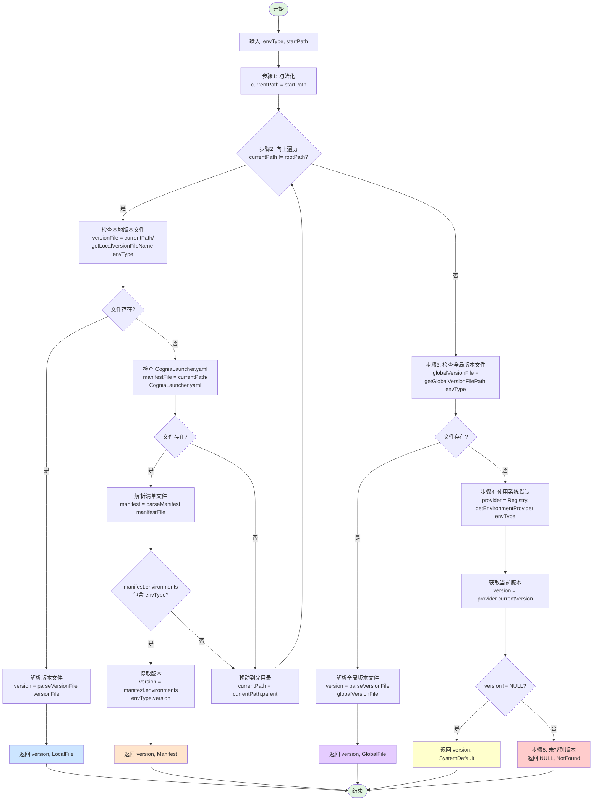

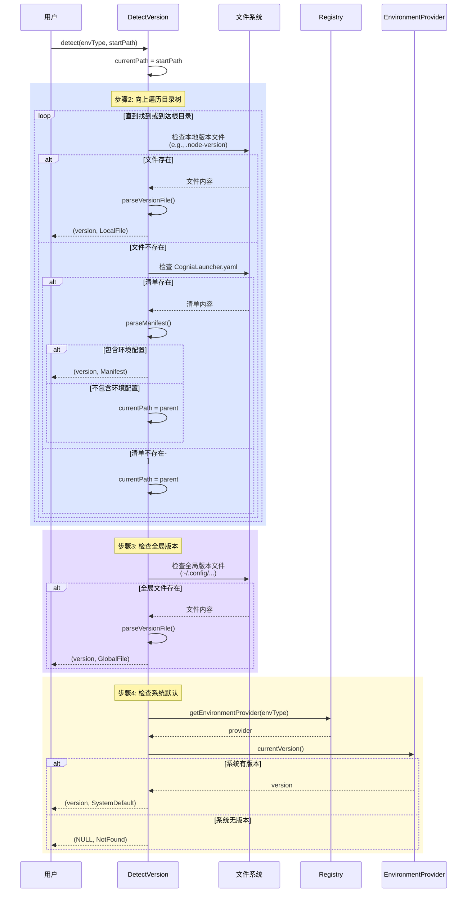
---

## 5. 数据设计

### 5.1 数据模型

#### 5.1.1 概念数据模型

```mermaid
erDiagram
    Package ||--o{ Version : has
    Package ||--o{ Dependency : declares
    Version ||--o{ Artifact : provides
    Version ||--o{ Dependency : requires
    
    Provider ||--o{ Package : manages
    
    InstalledPackage ||--|| Version : references
    InstalledPackage }o--|| Provider : installedBy
    
    Environment ||--o{ InstalledPackage : contains
    
    LockFile ||--o{ LockedPackage : locks
    LockedPackage ||--|| Version : specifies
    
    Manifest ||--o{ Dependency : declares
    Manifest ||--o{ EnvironmentSpec : requires
```

#### 5.1.2 核心实体定义

**Package（包）**

| 属性 | 类型 | 描述 |
|------|------|------|
| name | String | 包名称，唯一标识 |
| displayName | String | 显示名称 |
| description | String | 描述 |
| homepage | URL | 主页 |
| license | String | 许可证 |
| keywords | List\<String\> | 关键词 |
| repository | URL | 源码仓库 |

**Version（版本）**

| 属性 | 类型 | 描述 |
|------|------|------|
| version | SemVer | 语义版本号 |
| releaseDate | DateTime | 发布日期 |
| deprecated | Boolean | 是否已废弃 |
| yanked | Boolean | 是否已撤回 |
| dependencies | List\<Dependency\> | 依赖列表 |
| artifacts | List\<Artifact\> | 制品列表 |

**Artifact（制品）**

| 属性 | 类型 | 描述 |
|------|------|------|
| url | URL | 下载地址 |
| size | Integer | 文件大小 |
| checksums | Map\<Algorithm, String\> | 校验和 |
| platform | Platform | 目标平台 |
| arch | Architecture | 目标架构 |
| type | ArtifactType | 制品类型 |

**InstalledPackage（已安装包）**

| 属性 | 类型 | 描述 |
|------|------|------|
| package | String | 包名称 |
| version | SemVer | 安装版本 |
| provider | String | 安装使用的 Provider |
| installPath | Path | 安装路径 |
| installedAt | DateTime | 安装时间 |
| installedBy | String | 安装方式（用户/依赖） |
| files | List\<Path\> | 安装的文件列表 |
| receipt | InstallReceipt | 安装凭证 |

### 5.2 存储设计

#### 5.2.1 目录结构

```
~/.CogniaLauncher/
├── config/
│   ├── config.toml           # 主配置文件
│   ├── providers/            # Provider 配置
│   │   ├── nvm.toml
│   │   ├── pyenv.toml
│   │   └── ...
│   └── mirrors.toml          # 镜像配置
│
├── cache/
│   ├── downloads/            # 下载缓存
│   │   ├── sha256-xxxxx/     # 按校验和组织
│   │   └── ...
│   ├── metadata/             # 元数据缓存
│   │   ├── npm/
│   │   ├── pypi/
│   │   └── github/
│   └── index.db              # 缓存索引（SQLite）
│
├── environments/             # 环境安装目录
│   ├── node/
│   │   ├── 18.19.0/
│   │   ├── 20.11.0/
│   │   └── current -> 20.11.0
│   ├── python/
│   │   ├── 3.11.7/
│   │   └── ...
│   └── rust/
│       └── ...
│
├── packages/                 # 自定义包安装目录
│   ├── ripgrep/
│   │   └── 14.0.0/
│   └── ...
│
├── bin/                      # 符号链接目录（加入 PATH）
│   ├── node -> ../environments/node/current/bin/node
│   ├── python -> ../environments/python/current/bin/python
│   └── ...
│
├── plugins/                  # 插件目录
│   ├── provider-vcpkg/
│   └── ...
│
├── state/
│   ├── installed.db          # 安装状态数据库（SQLite）
│   └── receipts/             # 安装凭证
│       ├── node-18.19.0.json
│       └── ...
│
└── logs/
    └── CogniaLauncher.log
```

#### 5.2.2 数据库 Schema

```sql
-- 已安装包表
CREATE TABLE installed_packages (
    id INTEGER PRIMARY KEY AUTOINCREMENT,
    name TEXT NOT NULL,
    version TEXT NOT NULL,
    provider TEXT NOT NULL,
    install_path TEXT NOT NULL,
    installed_at DATETIME DEFAULT CURRENT_TIMESTAMP,
    installed_by TEXT DEFAULT 'user',  -- user, dependency
    is_global BOOLEAN DEFAULT TRUE,
    project_path TEXT,                  -- 项目路径（如果是本地安装）
    
    UNIQUE(name, version, project_path)
);

-- 包文件清单表
CREATE TABLE package_files (
    id INTEGER PRIMARY KEY AUTOINCREMENT,
    package_id INTEGER NOT NULL REFERENCES installed_packages(id),
    file_path TEXT NOT NULL,
    file_hash TEXT,
    file_size INTEGER,
    
    UNIQUE(package_id, file_path)
);

-- 环境版本表
CREATE TABLE environment_versions (
    id INTEGER PRIMARY KEY AUTOINCREMENT,
    env_type TEXT NOT NULL,        -- node, python, rust, etc.
    version TEXT NOT NULL,
    install_path TEXT NOT NULL,
    is_current BOOLEAN DEFAULT FALSE,
    installed_at DATETIME DEFAULT CURRENT_TIMESTAMP,
    
    UNIQUE(env_type, version)
);

-- 缓存索引表
CREATE TABLE cache_entries (
    id INTEGER PRIMARY KEY AUTOINCREMENT,
    key TEXT NOT NULL UNIQUE,
    file_path TEXT NOT NULL,
    size INTEGER NOT NULL,
    checksum TEXT NOT NULL,
    created_at DATETIME DEFAULT CURRENT_TIMESTAMP,
    last_accessed DATETIME,
    expires_at DATETIME,
    hit_count INTEGER DEFAULT 0
);

-- 创建索引
CREATE INDEX idx_installed_name ON installed_packages(name);
CREATE INDEX idx_installed_provider ON installed_packages(provider);
CREATE INDEX idx_cache_key ON cache_entries(key);
CREATE INDEX idx_cache_expires ON cache_entries(expires_at);
```

### 5.3 配置文件格式

#### 5.3.1 主配置文件 (config.toml)

```toml
# CogniaLauncher 主配置文件

[general]
# 默认并行下载数
parallel_downloads = 4
# 默认解析策略
resolve_strategy = "latest"  # latest, minimal, locked
# 是否自动更新元数据
auto_update_metadata = true
# 元数据缓存过期时间（秒）
metadata_cache_ttl = 3600

[network]
# 网络超时（秒）
timeout = 30
# 重试次数
retries = 3
# 代理设置
# proxy = "http://proxy.example.com:8080"

[mirrors]
# 镜像配置
[mirrors.npm]
url = "https://registry.npmmirror.com"
priority = 100

[mirrors.pypi]
url = "https://pypi.tuna.tsinghua.edu.cn/simple"
priority = 100

[providers]
# Provider 优先级和配置
[providers.brew]
enabled = true
priority = 100

[providers.apt]
enabled = true
priority = 90

[providers.winget]
enabled = true
priority = 100

[providers.github]
enabled = true
# GitHub API Token（可选，用于提高速率限制）
# token = "ghp_xxxx"

[paths]
# 自定义路径（可选，默认使用 ~/.CogniaLauncher）
# root = "/custom/path/to/CogniaLauncher"
# cache = "/custom/cache/path"
# environments = "/custom/envs/path"

[telemetry]
# 遥测设置
enabled = false
```

#### 5.3.2 项目 Manifest (CogniaLauncher.yaml)

```yaml
# yaml-language-server: $schema=https://CogniaLauncher.dev/schema/manifest-v1.json

# 项目元信息
project:
  name: my-awesome-project
  version: 1.0.0
  description: An awesome project

# 环境要求
environments:
  node:
    version: ">=18.0.0 <21.0.0"
    provider: nvm  # 可选
    
  python:
    version: "~3.11"
    provider: pyenv
    
  rust:
    version: stable
    components:
      - rustfmt
      - clippy
    targets:
      - x86_64-unknown-linux-gnu
      - aarch64-apple-darwin

# 系统包依赖
packages:
  # 简写形式
  - git
  - curl
  
  # 详细形式
  - name: docker
    version: ">=20.0"
    optional: true
    platforms: [linux, macos]
    
  # 指定 provider
  - name: neovim
    provider: brew
    version: latest

# 自定义包（从 GitHub 等源安装）
custom_packages:
  - name: ripgrep
    source:
      github: BurntSushi/ripgrep
      asset_pattern: "ripgrep-{version}-{arch}-{os}.{ext}"
    version: ">=13.0"
    binaries:
      - rg
      
  - name: internal-tool
    source:
      url: "https://artifacts.company.com/{name}/{version}/{platform}.tar.gz"
    version: "2.0.0"
    checksum:
      sha256: "abc123..."
    post_install:
      - "./configure"
      - "make install"

# 平台特定配置
platforms:
  windows:
    environments:
      node:
        provider: nvm-windows
    packages:
      - name: visual-studio-buildtools
        provider: winget
        version: latest
        
  linux:
    packages:
      - name: build-essential
        provider: apt
        
  macos:
    packages:
      - name: xcode-select
        provider: system

# 开发/生产环境区分
profiles:
  development:
    packages:
      - name: docker-compose
      - name: kubectl
        
  production:
    packages:
      - name: pm2

# Hooks
hooks:
  post_install:
    - run: ./scripts/setup.sh
      platforms: [linux, macos]
    - run: ./scripts/setup.ps1
      platforms: [windows]
      
  pre_update:
    - run: ./scripts/backup.sh
```

#### 5.3.3 锁文件 (CogniaLauncher-lock.yaml)

```yaml
# 此文件由 CogniaLauncher 自动生成，请勿手动编辑
# Generated by CogniaLauncher v1.0.0

lockfile_version: 1

generated_at: "2026-01-12T19:06:00+08:00"
generated_by: "CogniaLauncher/1.0.0"

# 环境锁定
environments:
  node:
    version: "18.19.0"
    provider: nvm
    resolved_at: "2026-01-12T19:06:00+08:00"
    
  python:
    version: "3.11.7"
    provider: pyenv
    resolved_at: "2026-01-12T19:06:00+08:00"

# 包锁定
packages:
  - name: git
    version: "2.43.0"
    provider: apt
    checksum:
      sha256: "abc123..."
    resolved_at: "2026-01-12T19:06:00+08:00"
    
  - name: ripgrep
    version: "14.0.3"
    provider: github
    source:
      github: BurntSushi/ripgrep
      tag: "14.0.3"
    artifacts:
      linux-x86_64:
        url: "https://github.com/.../ripgrep-14.0.3-x86_64-unknown-linux-musl.tar.gz"
        checksum:
          sha256: "def456..."
      darwin-x86_64:
        url: "https://github.com/.../ripgrep-14.0.3-x86_64-apple-darwin.tar.gz"
        checksum:
          sha256: "ghi789..."
      darwin-aarch64:
        url: "https://github.com/.../ripgrep-14.0.3-aarch64-apple-darwin.tar.gz"
        checksum:
          sha256: "jkl012..."
    resolved_at: "2026-01-12T19:06:00+08:00"

# 依赖图快照（用于快速验证）
dependency_graph_hash: "sha256:xyz..."
```

### 5.4 自定义包描述格式

```yaml
# .CogniaLauncher-package.yaml - 自定义包描述文件

# 包元信息
name: my-tool
version: 2.1.0
description: "A powerful development tool"
homepage: https://github.com/owner/my-tool
license: MIT
repository: https://github.com/owner/my-tool

authors:
  - name: Author Name
    email: author@example.com

keywords:
  - cli
  - development
  - tool

# 版本发现规则
versioning:
  # 从 GitHub Release 获取版本
  source: github-releases
  repo: owner/my-tool
  # 版本标签格式
  tag_pattern: "v{version}"
  # 预发布过滤
  include_prereleases: false

# 制品规则
artifacts:
  # 制品 URL 模板
  url_template: "https://github.com/owner/my-tool/releases/download/v{version}/{filename}"
  
  # 文件名映射规则
  files:
    - platforms: [linux]
      archs: [x86_64]
      filename: "my-tool-{version}-linux-amd64.tar.gz"
      type: archive
      
    - platforms: [linux]
      archs: [aarch64]
      filename: "my-tool-{version}-linux-arm64.tar.gz"
      type: archive
      
    - platforms: [darwin]
      archs: [x86_64, aarch64]
      filename: "my-tool-{version}-darwin-universal.tar.gz"
      type: archive
      
    - platforms: [windows]
      archs: [x86_64]
      filename: "my-tool-{version}-windows-amd64.zip"
      type: archive

# 安装配置
install:
  # 二进制文件列表（从归档中提取）
  binaries:
    - name: my-tool
      source_path: "my-tool"  # 归档中的路径
      
  # 额外文件
  files:
    - source: "completions/my-tool.bash"
      dest: "$COMPLETION_DIR/my-tool.bash"
    - source: "man/my-tool.1"
      dest: "$MAN_DIR/man1/my-tool.1"
      
  # 安装后脚本
  post_install:
    - command: "my-tool --init"
      platforms: [linux, darwin]

# 依赖声明
dependencies:
  runtime:
    - name: openssl
      version: ">=1.1"
      optional: true
  build: []

# 平台特定覆盖
platform_overrides:
  windows:
    install:
      binaries:
        - name: my-tool.exe
          source_path: "my-tool.exe"
```

---

## 6. 接口设计

### 6.1 Provider 接口规范

#### 6.1.1 基础 Provider 接口

```
接口: IProvider

描述: 所有 Provider 必须实现的基础接口

属性:
  - id: String [只读]
      Provider 唯一标识符
      示例: "nvm", "apt", "github"
      
  - displayName: String [只读]
      人类可读名称
      示例: "Node Version Manager", "APT Package Manager"
      
  - version: String [只读]
      Provider 实现版本
      
  - capabilities: Set<Capability> [只读]
      支持的能力集合
      
  - supportedPlatforms: Set<Platform> [只读]
      支持的平台集合
      
  - priority: Integer [只读]
      优先级，数值越大优先级越高
      默认: 0

方法:
  + initialize(config: ProviderConfig): Result<void, Error>
      初始化 Provider
      
      参数:
        - config: Provider 特定配置
      返回:
        - 成功或错误
      
  + isAvailable(): Result<Boolean, Error>
      检查 Provider 是否可用（依赖是否满足）
      
      返回:
        - true: 可用
        - false: 不可用
        - Error: 检查过程出错
      
  + search(query: String, options: SearchOptions): Result<List<PackageSummary>, Error>
      搜索包
      
      参数:
        - query: 搜索关键词
        - options: 搜索选项（分页、过滤等）
      返回:
        - 匹配的包摘要列表
        
  + getPackageInfo(name: String): Result<PackageInfo, Error>
      获取包详情
      
      参数:
        - name: 包名称
      返回:
        - 包详细信息
        
  + getVersions(name: String): Result<List<VersionInfo>, Error>
      获取包的所有可用版本
      
      参数:
        - name: 包名称
      返回:
        - 版本列表，按版本号降序排列
        
  + install(request: InstallRequest): Result<InstallReceipt, Error>
      安装包
      
      参数:
        - request: 安装请求
      返回:
        - 安装凭证（包含安装路径、文件清单等）
        
  + uninstall(request: UninstallRequest): Result<void, Error>
      卸载包
      
      参数:
        - request: 卸载请求
      返回:
        - 成功或错误
        
  + listInstalled(filter: InstalledFilter): Result<List<InstalledPackage>, Error>
      列出已安装的包
      
      参数:
        - filter: 过滤条件
      返回:
        - 已安装包列表
        
  + checkUpdates(packages: List<String>): Result<List<UpdateInfo>, Error>
      检查更新
      
      参数:
        - packages: 要检查的包列表（空则检查全部）
      返回:
        - 可用更新列表

能力枚举 Capability:
  - INSTALL         # 安装
  - UNINSTALL       # 卸载
  - UPDATE          # 更新
  - SEARCH          # 搜索
  - LIST            # 列出
  - LOCK_VERSION    # 锁定版本
  - ROLLBACK        # 回滚
```

#### 6.1.2 环境 Provider 接口

```
接口: IEnvironmentProvider 继承 IProvider

描述: 环境管理 Provider 的扩展接口

额外能力:
  - VERSION_SWITCH  # 版本切换
  - MULTI_VERSION   # 多版本共存
  - PROJECT_LOCAL   # 项目本地版本

额外方法:
  + listInstalledVersions(): Result<List<InstalledVersion>, Error>
      列出已安装的版本
      
      返回:
        - 版本列表，包含安装路径、大小等信息
        
  + getCurrentVersion(): Result<Version?, Error>
      获取当前激活的版本
      
      返回:
        - 当前版本，如果没有激活则返回 null
        
  + setGlobalVersion(version: Version): Result<void, Error>
      设置全局默认版本
      
      参数:
        - version: 目标版本
      返回:
        - 成功或错误
        
  + setLocalVersion(projectPath: Path, version: Version): Result<void, Error>
      设置项目本地版本
      
      参数:
        - projectPath: 项目路径
        - version: 目标版本
      返回:
        - 成功或错误
        
  + detectVersion(startPath: Path): Result<VersionDetection?, Error>
      检测应该使用的版本
      
      参数:
        - startPath: 开始检测的路径
      返回:
        - 检测结果，包含版本和来源
        
  + getEnvironmentModifications(version: Version): Result<EnvModifications, Error>
      获取激活特定版本需要的环境变量修改
      
      参数:
        - version: 目标版本
      返回:
        - 环境变量修改描述

数据类型:
  VersionDetection:
    - version: Version
    - source: VersionSource
    - sourcePath: Path?
    
  VersionSource: Enum
    - LOCAL_FILE      # 项目本地版本文件
    - MANIFEST        # CogniaLauncher.yaml
    - GLOBAL_FILE     # 全局版本文件
    - SYSTEM_DEFAULT  # 系统默认
    
  EnvModifications:
    - pathPrepend: List<Path>
    - pathAppend: List<Path>
    - setVariables: Map<String, String>
    - unsetVariables: List<String>
```

#### 6.1.3 自定义源 Provider 接口

```
接口: ICustomSourceProvider 继承 IProvider

描述: 自定义包源 Provider 的扩展接口

额外方法:
  + parsePackageDescriptor(content: String): Result<PackageDescriptor, Error>
      解析包描述文件
      
      参数:
        - content: 描述文件内容
      返回:
        - 解析后的包描述
        
  + fetchReleases(source: PackageSource): Result<List<Release>, Error>
      从源获取发布信息
      
      参数:
        - source: 包源配置
      返回:
        - 发布列表
        
  + resolveArtifact(release: Release, platform: Platform): Result<Artifact, Error>
      解析特定平台的制品
      
      参数:
        - release: 发布信息
        - platform: 目标平台
      返回:
        - 制品信息
        
  + downloadArtifact(artifact: Artifact, dest: Path, progress: IProgress): Result<Path, Error>
      下载制品
      
      参数:
        - artifact: 制品信息
        - dest: 目标目录
        - progress: 进度回调
      返回:
        - 下载后的文件路径
        
  + verifyArtifact(path: Path, expected: Checksum): Result<Boolean, Error>
      验证制品完整性
      
      参数:
        - path: 文件路径
        - expected: 期望的校验和
      返回:
        - 验证结果
```

### 6.2 插件接口规范

#### 6.2.1 插件清单格式

```yaml
# plugin.yaml - 插件清单文件

# 插件元信息
name: CogniaLauncher-provider-vcpkg
version: 1.0.0
description: "vcpkg C/C++ package manager provider for CogniaLauncher"
author: Plugin Author
license: MIT
homepage: https://github.com/author/CogniaLauncher-provider-vcpkg
repository: https://github.com/author/CogniaLauncher-provider-vcpkg

# CogniaLauncher 兼容性
CogniaLauncher_version: ">=1.0.0"

# 插件类型
type: provider  # provider, hook, formatter, command

# 入口点
entrypoint:
  # 根据实现语言不同
  # 动态库
  library: "libCogniaLauncher_vcpkg.so"  # Linux
  # 或可执行文件（通过 JSON-RPC 通信）
  executable: "CogniaLauncher-vcpkg-provider"
  protocol: json-rpc

# Provider 特定配置
provider:
  id: vcpkg
  display_name: "vcpkg"
  capabilities:
    - INSTALL
    - UNINSTALL
    - SEARCH
    - LIST
  platforms:
    - windows
    - linux
    - darwin

# 依赖
dependencies:
  runtime:
    - name: git
      version: ">=2.0"
    - name: cmake
      version: ">=3.15"
      optional: true

# 配置 Schema
config_schema:
  type: object
  properties:
    vcpkg_root:
      type: string
      description: "vcpkg installation root"
    default_triplet:
      type: string
      description: "Default target triplet"
```

#### 6.2.2 插件生命周期接口

```
接口: IPlugin

方法:
  + onLoad(context: PluginContext): Result<void, Error>
      插件加载时调用
      
  + onUnload(): Result<void, Error>
      插件卸载时调用
      
  + onEnable(): Result<void, Error>
      插件启用时调用
      
  + onDisable(): Result<void, Error>
      插件禁用时调用
      
  + getProvider(): IProvider?
      获取 Provider 实例（如果是 Provider 插件）
      
  + getHooks(): List<IHook>
      获取 Hook 实现列表
      
  + getCommands(): List<ICommand>
      获取自定义命令列表
```

### 6.3 Hook 接口规范

```
接口: IHook

描述: 生命周期钩子接口

属性:
  - name: String
      Hook 名称
  - priority: Integer
      执行优先级

Hook 点枚举 HookPoint:
  # 安装相关
  - PRE_RESOLVE       # 依赖解析前
  - POST_RESOLVE      # 依赖解析后
  - PRE_DOWNLOAD      # 下载前
  - POST_DOWNLOAD     # 下载后
  - PRE_INSTALL       # 安装前
  - POST_INSTALL      # 安装后
  
  # 卸载相关
  - PRE_UNINSTALL     # 卸载前
  - POST_UNINSTALL    # 卸载后
  
  # 环境相关
  - PRE_ENV_SWITCH    # 环境切换前
  - POST_ENV_SWITCH   # 环境切换后
  
  # 其他
  - PRE_UPDATE        # 更新前
  - POST_UPDATE       # 更新后
  - ON_ERROR          # 错误发生时

方法:
  + execute(context: HookContext): Result<HookResult, Error>
      执行 Hook
      
      参数:
        - context: Hook 上下文，包含操作信息
      返回:
        - HookResult:
            - Continue: 继续执行
            - Skip: 跳过当前操作
            - Abort: 中止整个流程
            - Modified(data): 返回修改后的数据

HookContext 数据类型:
  - hookPoint: HookPoint
  - operation: Operation
  - packages: List<PackageInfo>
  - options: Map<String, Any>
  - previousResults: List<HookResult>
```

### 6.4 外部系统接口

#### 6.4.1 GitHub API 接口适配

```
模块: GitHubApiClient

描述: GitHub API 封装

配置:
  - baseUrl: String = "https://api.github.com"
  - token: String? = null  # 可选认证 token
  - timeout: Duration = 30s
  - maxRetries: Integer = 3

方法:
  + getReleases(owner: String, repo: String, options: ReleaseOptions): Result<List<GitHubRelease>, Error>
      获取仓库的发布列表
      
      参数:
        - owner: 仓库所有者
        - repo: 仓库名称
        - options:
            - perPage: Integer = 30
            - page: Integer = 1
            - includePrerelease: Boolean = false
      返回:
        - GitHub Release 列表
      
  + getRelease(owner: String, repo: String, tag: String): Result<GitHubRelease, Error>
      获取特定发布
      
  + getReleaseAssets(owner: String, repo: String, releaseId: Integer): Result<List<GitHubAsset>, Error>
      获取发布的制品列表
      
  + downloadAsset(asset: GitHubAsset, dest: Path, progress: IProgress): Result<Path, Error>
      下载制品
      
  + getLatestRelease(owner: String, repo: String): Result<GitHubRelease, Error>
      获取最新发布

速率限制处理:
  - 实现指数退避重试
  - 缓存 ETag/Last-Modified 支持条件请求
  - 支持通过 token 提升限制

数据映射:
  GitHubRelease -> Release:
    - tag_name -> version (去除 "v" 前缀)
    - published_at -> releaseDate
    - prerelease -> isPrerelease
    - assets -> artifacts
```

#### 6.4.2 系统包管理器接口适配

```
模块: SystemPackageAdapter

描述: 系统包管理器命令行适配

子模块: AptAdapter (Debian/Ubuntu)
  命令映射:
    - search: apt-cache search {query}
    - info: apt-cache show {package}
    - install: apt-get install -y {package}={version}
    - uninstall: apt-get remove -y {package}
    - list: dpkg-query -l
    - update_index: apt-get update
    
  输出解析:
    - 使用正则表达式解析命令输出
    - 处理不同语言环境的输出格式
    
  权限处理:
    - 检测是否需要 sudo
    - 支持 polkit 授权

子模块: BrewAdapter (macOS)
  命令映射:
    - search: brew search {query}
    - info: brew info --json=v2 {package}
    - install: brew install {package}@{version}
    - uninstall: brew uninstall {package}
    - list: brew list --versions
    - update_index: brew update
    
  特殊处理:
    - 支持 Cask (GUI 应用)
    - 处理 tap 仓库

子模块: WingetAdapter (Windows)
  命令映射:
    - search: winget search {query} --source winget
    - info: winget show {package} --source winget
    - install: winget install {package} --version {version} --silent
    - uninstall: winget uninstall {package} --silent
    - list: winget list
    
  特殊处理:
    - 处理 UAC 提权
    - 支持 MSStore 源
```

---

## 7. 错误处理设计

### 7.1 错误分类

```mermaid
flowchart TB
    subgraph ErrorHierarchy["错误层次结构"]
        ROOT[CogniaLauncherError]
        
        ROOT --> CONFIG[ConfigError]
        ROOT --> NETWORK[NetworkError]
        ROOT --> PROVIDER[ProviderError]
        ROOT --> RESOLVE[ResolveError]
        ROOT --> INSTALL[InstallError]
        ROOT --> PLATFORM[PlatformError]
        
        CONFIG --> CONFIG_PARSE[ParseError]
        CONFIG --> CONFIG_VALIDATE[ValidationError]
        CONFIG --> CONFIG_IO[IoError]
        
        NETWORK --> NET_TIMEOUT[TimeoutError]
        NETWORK --> NET_DNS[DnsError]
        NETWORK --> NET_SSL[SslError]
        NETWORK --> NET_HTTP[HttpError]
        
        RESOLVE --> RES_CONFLICT[ConflictError]
        RESOLVE --> RES_NOTFOUND[PackageNotFoundError]
        RESOLVE --> RES_NOVERSION[NoMatchingVersionError]
        
        INSTALL --> INST_CHECKSUM[ChecksumMismatchError]
        INSTALL --> INST_PERM[PermissionError]
        INSTALL --> INST_SPACE[InsufficientSpaceError]
    end
```

### 7.2 错误码规范

| 范围 | 类别 | 示例 |
|------|------|------|
| E1xxx | 配置错误 | E1001 配置文件语法错误 |
| E2xxx | 网络错误 | E2001 连接超时 |
| E3xxx | Provider 错误 | E3001 Provider 不可用 |
| E4xxx | 解析错误 | E4001 依赖冲突 |
| E5xxx | 安装错误 | E5001 校验失败 |
| E6xxx | 平台错误 | E6001 权限不足 |
| E9xxx | 内部错误 | E9001 未知错误 |

### 7.3 错误处理策略

```
策略: ErrorHandlingStrategy

原则:
1. 快速失败 (Fail Fast)
   - 配置错误、权限错误立即终止
   
2. 优雅降级 (Graceful Degradation)
   - 网络错误尝试重试
   - 单个包安装失败不影响其他包
   
3. 可恢复性 (Recoverability)
   - 安装过程支持断点续传
   - 失败后支持回滚
   
4. 可诊断性 (Diagnosability)
   - 详细的错误上下文
   - 建议的解决方案

错误输出格式:
  ┌─ Error ──────────────────────────────────────────────
  │ 
  │  Code: E4001
  │  Type: DependencyConflict
  │  
  │  Message: Cannot resolve dependencies for project
  │  
  │  Details:
  │    Package 'foo' requires 'bar@^1.0'
  │    Package 'baz' requires 'bar@^2.0'
  │    
  │  Suggestions:
  │    1. Update 'foo' to a newer version that supports bar@^2.0
  │    2. Use 'CogniaLauncher install --force' to override (not recommended)
  │    3. Check if 'foo' and 'baz' can be updated together
  │  
  │  More info: https://CogniaLauncher.dev/errors/E4001
  │  
  └─────────────────────────────────────────────────────
```

### 7.4 重试机制

```
算法: RetryWithExponentialBackoff

参数:
  - maxRetries: Integer = 3
  - baseDelay: Duration = 1s
  - maxDelay: Duration = 30s
  - jitter: Float = 0.1

流程:
  attempt = 0
  WHILE attempt < maxRetries DO
    TRY
      result = executeOperation()
      RETURN Success(result)
    CATCH error
      IF NOT isRetryable(error) THEN
        RETURN Failure(error)
      END IF
      
      attempt = attempt + 1
      IF attempt >= maxRetries THEN
        RETURN Failure(error)
      END IF
      
      // 计算延迟
      delay = min(baseDelay * (2 ^ attempt), maxDelay)
      delay = delay * (1 + random(-jitter, jitter))
      
      log.warn("Retry attempt {attempt} after {delay}")
      sleep(delay)
    END TRY
  END WHILE

可重试错误类型:
  - TimeoutError
  - ConnectionResetError
  - RateLimitError (需要更长延迟)
  - TemporaryServerError (5xx)

不可重试错误类型:
  - AuthenticationError
  - NotFoundError
  - ValidationError
  - PermissionError
```

---

## 8. 安全性设计

### 8.1 威胁模型

| 威胁 | 描述 | 风险等级 | 缓解措施 |
|------|------|----------|----------|
| 供应链攻击 | 恶意包替换合法包 | 高 | 校验和验证、签名验证 |
| 中间人攻击 | 网络传输被篡改 | 高 | 强制 HTTPS、证书固定 |
| 本地提权 | 利用安装过程提权 | 中 | 最小权限、沙箱执行 |
| 配置注入 | 恶意配置执行代码 | 中 | 配置验证、禁止执行 |
| 路径遍历 | 恶意路径覆盖系统文件 | 中 | 路径规范化、白名单 |

### 8.2 安全措施

#### 8.2.1 完整性验证

```
流程: VerifyArtifactIntegrity

输入:
  - artifact: 下载的文件
  - expectedChecksum: 期望的校验和
  - signature: 可选的签名

步骤:
1. 计算文件校验和
   actualChecksum = calculateChecksum(artifact, algorithm)
   
2. 比较校验和
   IF actualChecksum != expectedChecksum THEN
     THROW ChecksumMismatchError(expected, actual)
   END IF

3. 验证签名（如果提供）
   IF signature != null THEN
     publicKey = getPublicKey(package.publisher)
     IF NOT verifySignature(artifact, signature, publicKey) THEN
       THROW SignatureVerificationError
     END IF
   END IF

4. RETURN verified
```

#### 8.2.2 安全配置

```toml
# 安全相关配置

[security]
# 是否允许 HTTP（仅开发环境）
allow_http = false

# 是否验证证书
verify_certificates = true

# 是否允许自签名证书（企业内部）
allow_self_signed = false

# 证书固定（可选）
[security.certificate_pins]
"github.com" = "sha256:xxx"
"registry.npmjs.org" = "sha256:yyy"

# 信任的发布者公钥
[security.trusted_publishers]
# publisher_id = "public_key_path"

# 沙箱设置
[security.sandbox]
# 是否在沙箱中运行安装脚本
enabled = true
# 沙箱类型
type = "firejail"  # firejail, bubblewrap, none
# 网络访问
network_access = false
# 文件系统访问白名单
fs_whitelist = [
  "$INSTALL_DIR",
  "$TEMP_DIR"
]
```

#### 8.2.3 权限管理

```
原则: 最小权限原则

用户态操作（无需提权）:
  - 环境安装到 ~/.CogniaLauncher/
  - 配置文件修改
  - 缓存管理
  - 用户级 PATH 修改

可能需要提权的操作:
  - 系统包安装 (apt, winget)
  - 系统级配置修改
  - 全局服务安装

提权处理:
1. 检测操作是否需要提权
   needsElevation = provider.requiresElevation(operation)
   
2. 如果需要，提示用户
   IF needsElevation THEN
     IF NOT confirmElevation(user) THEN
       THROW UserCancelledError
     END IF
   END IF
   
3. 使用平台特定机制提权
   SWITCH platform
     CASE linux, macos:
       execute_with_sudo(command)
     CASE windows:
       execute_with_uac(command)
   END SWITCH
```

---

## 9. 设计难点与解决方案

### 9.1 难点一：跨平台 Provider 抽象

#### 问题描述

不同平台的包管理器差异巨大：

- **命令差异**：apt install vs brew install vs winget install
- **输出格式差异**：文本 vs JSON vs XML
- **行为差异**：依赖处理、版本命名、安装路径
- **权限模型差异**：sudo vs UAC vs pkexec

#### 解决方案

```mermaid
flowchart TB
    subgraph Abstraction["抽象层设计"]
        IProvider[IProvider 接口]
        BaseProvider[BaseProvider 基类]
        
        IProvider --> BaseProvider
        
        BaseProvider --> CommandExecutor[命令执行器]
        BaseProvider --> OutputParser[输出解析器]
        BaseProvider --> PathResolver[路径解析器]
        
        CommandExecutor --> PlatformCommand[平台命令适配]
        OutputParser --> FormatParser[格式解析器<br/>Text/JSON/XML]
        PathResolver --> PlatformPaths[平台路径规范]
    end
    
    subgraph Implementation["具体实现"]
        AptProvider[AptProvider]
        BrewProvider[BrewProvider]
        WingetProvider[WingetProvider]
        
        AptProvider --> AptCommands[apt 命令]
        BrewProvider --> BrewCommands[brew 命令]
        WingetProvider --> WingetCommands[winget 命令]
    end
    
    BaseProvider --> AptProvider
    BaseProvider --> BrewProvider
    BaseProvider --> WingetProvider
```

**设计要点**：

1. **命令模板化**

```
CommandTemplate:
  install: "{manager} install {flags} {package}{version_sep}{version}"
  
AptTemplate:
  manager: "apt-get"
  flags: "-y"
  version_sep: "="
  
BrewTemplate:
  manager: "brew"
  flags: ""
  version_sep: "@"
```

1. **输出适配器模式**

```
OutputAdapter:
  + parse(raw: String, format: Format): StructuredOutput
  
AptOutputAdapter:
  format: REGEX
  patterns:
    package: "^(\S+)\s+(\S+)\s+(.*)$"
    
BrewOutputAdapter:
  format: JSON
  mapping:
    name: "$.name"
    version: "$.versions.stable"
```

### 9.2 难点二：依赖解析复杂度

#### 问题描述

- **NP-Complete**：依赖解析本质是布尔可满足性问题（SAT）
- **版本约束复杂**：支持多种约束语法（semver、python 版本规范等）
- **跨 Provider 依赖**：一个包可能依赖另一个 Provider 管理的包
- **平台条件依赖**：某些依赖只在特定平台需要

#### 解决方案

采用 **PubGrub 算法**（Dart/Pub 和 Cargo 使用的算法）:

```mermaid
flowchart TB
    subgraph PubGrub["PubGrub 算法流程"]
        START[开始] --> INIT[初始化部分解]
        INIT --> PROPAGATE[单元传播]
        PROPAGATE --> CHECK{解完成?}
        CHECK -->|是| SUCCESS[返回解]
        CHECK -->|否| DECIDE[选择变量决策]
        DECIDE --> PROPAGATE
        PROPAGATE --> CONFLICT{冲突?}
        CONFLICT -->|是| ANALYZE[冲突分析]
        ANALYZE --> LEARN[学习不兼容性]
        LEARN --> BACKTRACK{可回溯?}
        BACKTRACK -->|是| UNDO[撤销决策]
        UNDO --> PROPAGATE
        BACKTRACK -->|否| FAILURE[无解]
    end
```

**优化策略**：

| 策略 | 描述 | 效果 |
|------|------|------|
| 版本缓存 | 缓存已查询的版本信息 | 减少网络请求 |
| 冲突学习 | 记录导致冲突的组合 | 避免重复探索 |
| 优先级引导 | 优先选择高频使用版本 | 加快收敛 |
| 增量解析 | 基于锁文件增量更新 | 减少计算量 |

### 9.3 难点三：环境隔离与切换

#### 问题描述

- **PATH 污染**：多版本运行时的 PATH 管理
- **Shell 集成**：不同 Shell 的配置方式不同
- **项目级切换**：进入目录自动切换版本
- **子进程继承**：确保子进程使用正确环境

#### 解决方案

```mermaid
flowchart TB
    subgraph EnvSwitch["环境切换机制"]
        SHIM[Shim 层] --> DETECT[版本检测]
        DETECT --> LOOKUP[查找版本文件]
        LOOKUP --> RESOLVE[解析目标版本]
        RESOLVE --> DELEGATE[委托给真实程序]
    end
    
    subgraph ShellIntegration["Shell 集成"]
        HOOK[目录切换 Hook]
        HOOK --> BASH["bash: PROMPT_COMMAND"]
        HOOK --> ZSH["zsh: chpwd"]
        HOOK --> FISH["fish: --on-variable PWD"]
        HOOK --> PS["PowerShell: prompt function"]
    end
    
    subgraph VersionFiles["版本文件层次"]
        LOCAL[".node-version<br/>.python-version"]
        MANIFEST["CogniaLauncher.yaml"]
        GLOBAL["~/.CogniaLauncher/versions/"]
        
        LOCAL --> MANIFEST --> GLOBAL
    end
```

**Shim 机制**：

```
Shim 实现原理:

~/.CogniaLauncher/bin/node (Shim)
  |
  v
1. 获取当前工作目录
2. 向上遍历查找 .node-version 或 CogniaLauncher.yaml
3. 解析版本约束
4. 查找对应版本的真实 node 路径
5. exec() 委托执行，传递所有参数

优点:
  - 透明：对用户和脚本透明
  - 高效：exec 替换进程，无额外开销
  - 兼容：不影响现有工具和脚本
```

### 9.4 难点四：可靠的安装与回滚

#### 问题描述

- **原子性**：安装过程中断可能导致状态不一致
- **回滚复杂**：需要记录所有变更以支持回滚
- **依赖顺序**：需要按正确顺序安装/卸载
- **并发冲突**：多进程同时操作可能冲突

#### 解决方案

**事务式安装**：

```mermaid
stateDiagram-v2
    [*] --> Planning
    Planning --> Staging: 创建事务
    Staging --> Verifying: 下载完成
    Verifying --> Installing: 验证通过
    Installing --> Committing: 安装完成
    Committing --> [*]: 提交成功
    
    Staging --> RollingBack: 下载失败
    Verifying --> RollingBack: 验证失败
    Installing --> RollingBack: 安装失败
    Committing --> RollingBack: 提交失败
    RollingBack --> [*]: 回滚完成
```

**实现要点**：

```
事务式安装算法:

1. Planning（计划阶段）
   - 解析依赖
   - 生成安装计划
   - 检查磁盘空间
   
2. Staging（暂存阶段）
   - 下载到临时目录 ~/.CogniaLauncher/staging/{transaction_id}/
   - 验证校验和
   - 解压到暂存区
   
3. Installing（安装阶段）
   - 备份现有文件到 ~/.CogniaLauncher/backup/{transaction_id}/
   - 使用硬链接或复制到目标位置
   - 记录所有变更到事务日志
   
4. Committing（提交阶段）
   - 更新安装数据库
   - 更新锁文件
   - 清理暂存区
   - 删除备份（可配置保留）
   
5. Rollback（回滚）
   - 读取事务日志
   - 逆序执行变更
   - 从备份恢复文件
   - 清理事务

并发控制:
   - 使用文件锁 ~/.CogniaLauncher/.lock
   - 锁粒度：全局锁 / 包级锁
   - 超时自动释放
```

### 9.5 难点五：GitHub Release 版本解析

#### 问题描述

- **命名不统一**：不同项目的 release 命名风格不同
- **制品命名不统一**：platform、arch 的命名方式各异
- **API 限制**：未认证请求 60 次/小时
- **预发布处理**：需要正确识别和过滤预发布版本

#### 解决方案

**智能模式匹配**：

```
制品匹配算法:

输入:
  - assets: GitHub Release 的 assets 列表
  - platform: 目标平台 (linux, darwin, windows)
  - arch: 目标架构 (x86_64, aarch64)

匹配规则表:
  platform_patterns:
    linux: ["linux", "Linux", "ubuntu", "debian", "musl", "gnu"]
    darwin: ["darwin", "Darwin", "macos", "macOS", "osx", "OSX", "apple"]
    windows: ["windows", "Windows", "win", "Win", "win32", "win64"]
    
  arch_patterns:
    x86_64: ["x86_64", "x86-64", "amd64", "AMD64", "64bit", "x64"]
    aarch64: ["aarch64", "arm64", "ARM64", "armv8"]
    
  exclude_patterns:
    - ".sha256"
    - ".sig"
    - ".asc"
    - "checksums"
    
匹配流程:
1. 过滤掉排除模式
2. 计算每个 asset 的匹配得分
3. 选择得分最高的 asset

得分计算:
  score = 0
  IF contains(platform_pattern) THEN score += 100
  IF contains(arch_pattern) THEN score += 50
  IF is_preferred_format(tar.gz, zip) THEN score += 10
  IF is_static_linked(musl) THEN score += 5
```

**API 限制缓解**：

| 策略 | 实现 |
|------|------|
| 条件请求 | 使用 ETag/If-None-Match 减少配额消耗 |
| 响应缓存 | 缓存 release 信息，设置合理 TTL |
| Token 配置 | 支持配置 GitHub Token 提升到 5000/小时 |
| 批量查询 | GraphQL API 批量查询减少请求次数 |

---

## 10. 实现难点与技术风险

### 10.1 技术风险矩阵

| 风险 | 可能性 | 影响 | 缓解措施 |
|------|--------|------|----------|
| 依赖解析算法实现复杂 | 高 | 高 | 采用成熟库（pubgrub）或充分测试 |
| 跨平台测试覆盖不足 | 高 | 中 | CI 矩阵测试、社区测试 |
| 外部 API 变更 | 中 | 中 | 适配层隔离、版本协商 |
| 性能问题 | 中 | 中 | 性能测试、缓存优化 |
| 安全漏洞 | 低 | 高 | 安全审计、最小权限 |

### 10.2 实现难点详述

#### 10.2.1 Shell 集成的兼容性

**难点**：

- Bash/Zsh/Fish/PowerShell 语法差异大
- 用户可能有复杂的 Shell 配置
- 需要优雅地修改 PATH 而不破坏现有配置

**解决方案**：

```
Shell 集成策略:

1. 生成独立的初始化脚本
   ~/.CogniaLauncher/shell/init.bash
   ~/.CogniaLauncher/shell/init.zsh
   ~/.CogniaLauncher/shell/init.fish
   ~/.CogniaLauncher/shell/init.ps1

2. 用户在配置文件中 source 该脚本
   # .bashrc
   [ -f ~/.CogniaLauncher/shell/init.bash ] && source ~/.CogniaLauncher/shell/init.bash

3. 初始化脚本职责:
   - 添加 ~/.CogniaLauncher/bin 到 PATH（检查避免重复）
   - 注册目录切换 Hook（可选）
   - 设置环境变量
   - 提供 shell 补全

4. 自动安装时的安全措施:
   - 备份原配置文件
   - 添加明确的注释标记
   - 提供卸载命令清理
```

#### 10.2.2 版本约束的统一化

**难点**：

- 不同生态的版本规范不同（semver、PEP 440、Cargo 版本）
- 需要支持复杂约束（AND、OR、NOT）
- 需要正确处理预发布版本

**解决方案**：

```mermaid
flowchart LR
    subgraph Input["输入格式"]
        NPM["npm: ^1.2.3"]
        PIP["pip: ~=1.2.3"]
        CARGO["cargo: 1.2.*"]
    end
    
    subgraph Parser["解析器"]
        PARSE[版本约束解析器]
    end
    
    subgraph Internal["内部表示"]
        IR["统一约束 IR"]
    end
    
    subgraph Operations["操作"]
        MATCH[匹配检查]
        INTERSECT[求交集]
        UNION[求并集]
    end
    
    NPM --> PARSE
    PIP --> PARSE
    CARGO --> PARSE
    PARSE --> IR
    IR --> MATCH
    IR --> INTERSECT
    IR --> UNION
```

#### 10.2.3 下载断点续传

**难点**：

- 需要服务器支持 Range 请求
- 临时文件管理
- 校验和验证的时机

**解决方案**：

```
断点续传算法:

下载开始:
1. 检查临时文件是否存在
   tempFile = cacheDir / (checksum + ".partial")
   
2. 如果存在，获取已下载大小
   downloadedBytes = tempFile.size()
   
3. 发送带 Range 头的请求
   headers["Range"] = "bytes={downloadedBytes}-"
   
4. 检查响应
   IF status == 206 (Partial Content) THEN
     // 追加模式写入
     appendToFile(tempFile, response.body)
   ELSE IF status == 200 THEN
     // 服务器不支持，重新下载
     truncateFile(tempFile)
     writeToFile(tempFile, response.body)
   END IF
   
5. 下载完成后
   actualChecksum = calculateChecksum(tempFile)
   IF actualChecksum == expectedChecksum THEN
     rename(tempFile, finalPath)
   ELSE
     delete(tempFile)
     THROW ChecksumMismatchError
   END IF
```

### 10.3 性能优化策略

```mermaid
flowchart TB
    subgraph Caching["缓存策略"]
        META_CACHE[元数据缓存<br/>TTL: 1小时]
        DOWNLOAD_CACHE[下载缓存<br/>按校验和索引]
        RESOLVE_CACHE[解析结果缓存<br/>按输入哈希]
    end
    
    subgraph Parallel["并行化"]
        PARALLEL_DL[并行下载<br/>默认 4 并发]
        PARALLEL_META[并行元数据获取]
        PARALLEL_VERIFY[并行校验]
    end
    
    subgraph Lazy["延迟加载"]
        LAZY_PROVIDER[Provider 延迟初始化]
        LAZY_META[元数据按需加载]
        LAZY_PLUGIN[插件延迟加载]
    end
```

---

## 11. 测试策略

### 11.1 测试金字塔

```mermaid
flowchart TB
    subgraph E2E["端到端测试 (10%)"]
        E2E_INSTALL[完整安装流程]
        E2E_UPDATE[完整更新流程]
        E2E_CROSS[跨平台测试]
    end
    
    subgraph Integration["集成测试 (30%)"]
        INT_PROVIDER[Provider 集成]
        INT_RESOLVE[解析器集成]
        INT_INSTALL[安装器集成]
    end
    
    subgraph Unit["单元测试 (60%)"]
        UNIT_VERSION[版本解析]
        UNIT_CONFIG[配置解析]
        UNIT_CACHE[缓存逻辑]
        UNIT_MATCH[模式匹配]
    end
    
    E2E --> Integration --> Unit
```

### 11.2 测试矩阵

| 平台 | 环境 Provider | 系统包 Provider |
|------|---------------|-----------------|
| Ubuntu 22.04 | nvm, pyenv, rustup | apt |
| Ubuntu 20.04 | nvm, pyenv, rustup | apt |
| macOS 13 (Intel) | nvm, pyenv, rustup | brew |
| macOS 14 (ARM) | nvm, pyenv, rustup | brew |
| Windows 10 | nvm-windows, pyenv-win | winget |
| Windows 11 | nvm-windows, pyenv-win | winget |

### 11.3 关键测试场景

| 场景 | 描述 | 验证点 |
|------|------|--------|
| TC-001 | 首次安装环境 | 版本正确、PATH 配置 |
| TC-002 | 多版本共存 | 隔离性、切换正确 |
| TC-003 | 依赖冲突解决 | 错误信息清晰 |
| TC-004 | 网络中断恢复 | 断点续传、回滚 |
| TC-005 | 权限不足处理 | 优雅降级、提示 |
| TC-006 | 配置迁移 | 兼容旧版本配置 |

---

## 12. 部署设计

### 12.1 分发方式

| 方式 | 适用场景 | 优点 | 缺点 |
|------|----------|------|------|
| 预编译二进制 | 主要分发方式 | 无依赖、快速 | 需要多平台编译 |
| Shell 脚本安装 | 快速安装 | 一条命令 | 需要网络 |
| 包管理器 | 系统集成 | 自动更新 | 版本可能滞后 |
| 源码编译 | 开发者 | 最新功能 | 需要编译环境 |

### 12.2 安装脚本设计

```bash
#!/bin/bash
# CogniaLauncher 安装脚本

set -e

CogniaLauncher_VERSION="${CogniaLauncher_VERSION:-latest}"
CogniaLauncher_HOME="${CogniaLauncher_HOME:-$HOME/.CogniaLauncher}"

# 检测平台
detect_platform() {
    OS="$(uname -s)"
    ARCH="$(uname -m)"
    
    case "$OS" in
        Linux*)  PLATFORM="linux" ;;
        Darwin*) PLATFORM="darwin" ;;
        MINGW*|MSYS*|CYGWIN*) PLATFORM="windows" ;;
        *) error "Unsupported OS: $OS" ;;
    esac
    
    case "$ARCH" in
        x86_64|amd64) ARCH="x86_64" ;;
        arm64|aarch64) ARCH="aarch64" ;;
        *) error "Unsupported architecture: $ARCH" ;;
    esac
}

# 下载并安装
install() {
    detect_platform
    
    URL="https://github.com/CogniaLauncher/CogniaLauncher/releases/download/${CogniaLauncher_VERSION}/CogniaLauncher-${PLATFORM}-${ARCH}.tar.gz"
    
    echo "Downloading CogniaLauncher ${CogniaLauncher_VERSION}..."
    curl -fsSL "$URL" | tar -xz -C /tmp
    
    echo "Installing to ${CogniaLauncher_HOME}..."
    mkdir -p "$CogniaLauncher_HOME/bin"
    mv /tmp/CogniaLauncher "$CogniaLauncher_HOME/bin/"
    
    echo "Configuring shell..."
    "$CogniaLauncher_HOME/bin/CogniaLauncher" self setup-shell
    
    echo "CogniaLauncher installed successfully!"
    echo "Please restart your shell or run: source ~/.bashrc"
}

install
```

### 12.3 升级策略

```
自更新算法:

1. 检查更新
   currentVersion = getInstalledVersion()
   latestVersion = fetchLatestVersion()
   
   IF currentVersion >= latestVersion THEN
     print("Already up to date")
     RETURN
   END IF

2. 下载新版本
   newBinary = downloadRelease(latestVersion)
   
3. 验证
   verify(newBinary, expectedChecksum)
   
4. 原子替换
   // 不能直接替换正在运行的二进制
   // 使用临时文件 + 重命名
   tempPath = CogniaLauncher_HOME / "bin" / "CogniaLauncher.new"
   write(tempPath, newBinary)
   
   backupPath = CogniaLauncher_HOME / "bin" / "CogniaLauncher.backup"
   rename(currentPath, backupPath)
   rename(tempPath, currentPath)
   
5. 验证新版本
   TRY
     execute(currentPath, "--version")
   CATCH
     // 回滚
     rename(backupPath, currentPath)
     THROW UpdateFailedError
   END TRY
   
6. 清理
   delete(backupPath)
```

---

## 13. 附录

### 13.1 术语表

| 术语 | 英文 | 定义 |
|------|------|------|
| 包 | Package | 可安装的软件单元 |
| 版本约束 | Version Constraint | 对版本的限制条件 |
| 依赖解析 | Dependency Resolution | 确定满足约束的版本组合 |
| 制品 | Artifact | 包的可下载文件 |
| 锁文件 | Lockfile | 记录精确版本的文件 |
| Provider | Provider | 与具体包管理器交互的适配器 |
| Shim | Shim | 透明代理程序 |

### 13.2 版本约束语法参考

| 语法 | 含义 | 示例 |
|------|------|------|
| 1.2.3 | 精确版本 | 仅匹配 1.2.3 |
| ^1.2.3 | 兼容版本 | >=1.2.3 <2.0.0 |
| ~1.2.3 | 近似版本 | >=1.2.3 <1.3.0 |
| >=1.2.3 | 最小版本 | 1.2.3 及以上 |
| >1.2.3 | 大于版本 | 高于 1.2.3 |
| <=1.2.3 | 最大版本 | 1.2.3 及以下 |
| <1.2.3 | 小于版本 | 低于 1.2.3 |
| 1.2.* | 通配符 | 1.2.x 任意补丁版本 |
| * | 任意版本 | 任何版本 |

### 13.3 配置选项完整参考

```toml
# 完整配置选项参考

[general]
# 日志级别: trace, debug, info, warn, error
log_level = "info"
# 日志文件路径
log_file = "~/.CogniaLauncher/logs/CogniaLauncher.log"
# 并行下载数
parallel_downloads = 4
# 解析策略: latest, minimal, locked
resolve_strategy = "latest"
# 颜色输出: auto, always, never
color = "auto"
# 进度条: auto, always, never
progress = "auto"

[network]
# 连接超时（秒）
connect_timeout = 10
# 读取超时（秒）
read_timeout = 30
# 重试次数
retries = 3
# 重试延迟（秒）
retry_delay = 1
# HTTP 代理
http_proxy = ""
# HTTPS 代理
https_proxy = ""
# 不使用代理的主机
no_proxy = "localhost,127.0.0.1"

[cache]
# 缓存目录
path = "~/.CogniaLauncher/cache"
# 最大缓存大小（MB）
max_size = 5000
# 元数据缓存 TTL（秒）
metadata_ttl = 3600
# 下载缓存 TTL（天）
download_ttl = 30

[providers]
# 默认启用的 providers（按优先级排序）
enabled = ["nvm", "pyenv", "rustup", "brew", "apt", "winget", "github"]

[providers.github]
# GitHub API Token
token = ""
# API 基础 URL（用于 GitHub Enterprise）
api_url = "https://api.github.com"

[providers.npm]
# NPM 镜像
registry = "https://registry.npmjs.org"

[providers.pypi]
# PyPI 镜像
index_url = "https://pypi.org/simple"

[security]
# 验证 HTTPS 证书
verify_ssl = true
# 允许 HTTP（不推荐）
allow_http = false
# 校验和验证
verify_checksums = true
```

### 13.4 错误码完整列表

| 错误码   | 名称                        | 描述            | 建议操作                   |
| ----- | ------------------------- | ------------- | ---------------------- |
| E1001 | CONFIG_PARSE_ERROR        | 配置文件语法错误      | 检查配置文件格式               |
| E1002 | CONFIG_VALIDATION_ERROR   | 配置值无效         | 检查配置值范围                |
| E1003 | CONFIG_NOT_FOUND          | 配置文件不存在       | 运行 CogniaLauncher init |
| E2001 | NETWORK_TIMEOUT           | 网络请求超时        | 检查网络连接                 |
| E2002 | NETWORK_DNS_ERROR         | DNS 解析失败      | 检查 DNS 设置              |
| E2003 | NETWORK_SSL_ERROR         | SSL/TLS 错误    | 检查证书配置                 |
| E2004 | NETWORK_RATE_LIMIT        | API 速率限制      | 配置认证 token             |
| E3001 | PROVIDER_NOT_AVAILABLE    | Provider 不可用  | 安装依赖工具                 |
| E3002 | PROVIDER_EXECUTION_ERROR  | Provider 执行错误 | 查看详细日志                 |
| E4001 | RESOLVE_CONFLICT          | 依赖冲突          | 调整版本约束                 |
| E4002 | RESOLVE_NOT_FOUND         | 包不存在          | 检查包名拼写                 |
| E4003 | RESOLVE_NO_VERSION        | 无匹配版本         | 放宽版本约束                 |
| E5001 | INSTALL_CHECKSUM_MISMATCH | 校验和不匹配        | 重试或报告问题                |
| E5002 | INSTALL_PERMISSION_DENIED | 权限不足          | 使用正确权限                 |
| E5003 | INSTALL_DISK_FULL         | 磁盘空间不足        | 清理磁盘空间                 |
| E6001 | PLATFORM_NOT_SUPPORTED    | 平台不支持         | 检查兼容性                  |
| E9001 | INTERNAL_ERROR            | 内部错误          | 报告 bug                 |

---

## 文档结束

本文档为 CogniaLauncher 项目的完整软件设计说明。随着项目演进，本文档将持续更新维护。

