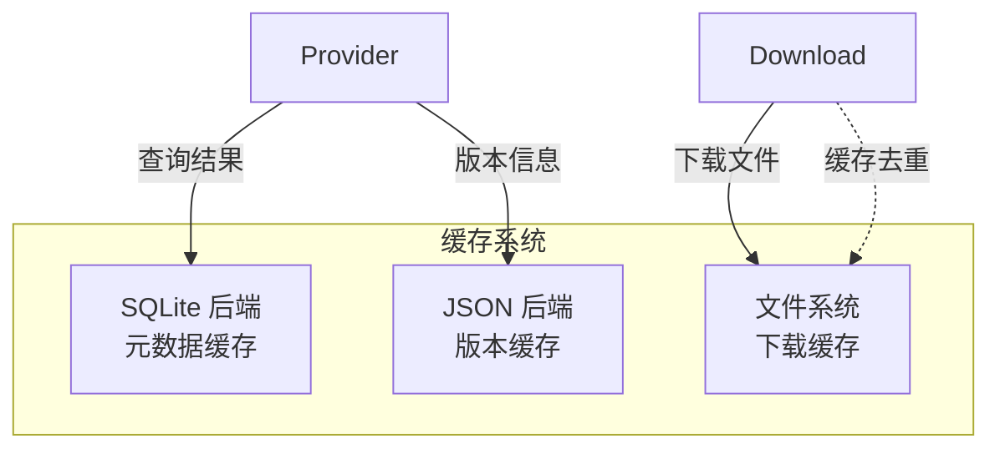

# 数据模型

CogniaLauncher 的数据存储设计涵盖缓存系统、配置管理、状态持久化和核心领域类型。

---

## 缓存架构

### 三后端设计



### SQLite 缓存

存储结构化元数据：

- 包信息（名称、版本、描述、依赖）
- 搜索结果
- Provider 状态
- 下载历史记录

### JSON 缓存

轻量级版本数据：

- 前端版本检测结果
- 配置快照
- 用户偏好

### 文件缓存

已下载的二进制文件和安装包，支持：

- 校验和验证（SHA256）
- 过期清理（可配置 `cache_max_age_days`）
- 磁盘空间管理（可配置 `cache_max_size`）
- 自动清理阈值（缓存使用率超过阈值百分比时触发清理）
- 残留清理（移除超过 7 天的不完整下载）
- 缓存命中快捷方式（已完成的带校验和下载自动去重）

---

## 配置系统

### 配置文件格式

```toml
# ~/.CogniaLauncher/config/config.toml

[general]
parallel_downloads = 4
resolve_strategy = "latest"       # latest | minimal | locked | prefer-locked
auto_update_metadata = true
metadata_cache_ttl = 3600
cache_max_size = 5368709120       # 5 GB
cache_max_age_days = 30
auto_clean_cache = true
cache_auto_clean_threshold = 80   # 百分比
cache_monitor_interval = 300      # 秒，0 = 禁用
download_speed_limit = 0          # 字节/秒，0 = 不限速

[network]
timeout = 30
retries = 3
proxy = ""
no_proxy = ""

[security]
allow_http = false
verify_certificates = true
allow_self_signed = false

[paths]
# root = "/custom/path"
# cache = "/custom/cache"
# environments = "/custom/envs"

[appearance]
theme = "system"                  # light | dark | system
accent_color = "blue"             # zinc | blue | green | purple | orange | rose
chart_color_theme = "default"     # default | vibrant | pastel | ocean | sunset | monochrome
interface_radius = 0.625
interface_density = "comfortable" # compact | comfortable | spacious
language = "en"                   # en | zh
reduced_motion = false

[terminal]
default_shell = "auto"
shell_integration = true
proxy_mode = "global"             # global | none | custom

[mirrors.npm]
url = "https://registry.npmmirror.com"
enabled = true
priority = 0
verify_ssl = true
```

### 设置结构

```rust
pub struct Settings {
    pub general: GeneralSettings,
    pub network: NetworkSettings,
    pub mirrors: HashMap<String, MirrorConfig>,
    pub providers: HashMap<String, ProviderSettings>,
    pub paths: PathSettings,
    pub security: SecuritySettings,
    pub provider_settings: GlobalProviderSettings,
    pub appearance: AppearanceSettings,
    pub terminal: TerminalSettings,
}
```

子结构说明：

| 结构体 | 字段 |
| ------ | ---- |
| `GeneralSettings` | `parallel_downloads`、`resolve_strategy`、`auto_update_metadata`、`metadata_cache_ttl`、`cache_max_size`、`cache_max_age_days`、`auto_clean_cache`、`min_install_space_mb`、`cache_auto_clean_threshold`、`cache_monitor_interval`、`cache_monitor_external`、`download_speed_limit` |
| `NetworkSettings` | `timeout`、`retries`、`proxy`、`no_proxy` |
| `SecuritySettings` | `allow_http`、`verify_certificates`、`allow_self_signed` |
| `PathSettings` | `root`、`cache`、`environments` |
| `AppearanceSettings` | `theme`、`accent_color`、`chart_color_theme`、`interface_radius`、`interface_density`、`language`、`reduced_motion` |
| `TerminalSettings` | `default_shell`、`default_profile_id`、`shell_integration`、`proxy_mode`、`custom_proxy`、`no_proxy` |
| `GlobalProviderSettings` | `pinned_packages`、`disabled_providers` |
| `MirrorConfig` | `url`、`priority`、`enabled`、`verify_ssl` |
| `ProviderSettings` | `enabled`、`priority`、`extra`（扁平化键值对） |

---

## 前端状态

### Zustand Store 数据模型

所有 Store 通过 `persist` 中间件序列化到 `localStorage`（`window-state` 除外，为临时状态）。

**appearance.ts** — UI 外观偏好（persist v6）

```typescript
interface AppearanceState {
  accentColor: AccentColor
  chartColorTheme: ChartColorTheme
  interfaceRadius: InterfaceRadius
  interfaceDensity: InterfaceDensity
  reducedMotion: boolean
  backgroundEnabled: boolean
  backgroundOpacity: number
  backgroundBlur: number
  backgroundFit: BackgroundFit  // 'cover' | 'contain' | 'fill' | 'tile'
}
```

**dashboard.ts** — 小部件布局与自定义（persist v2）

```typescript
interface DashboardState {
  widgets: WidgetConfig[]   // 15 种小部件：stats-overview、environment-chart、
  isCustomizing: boolean    //   package-chart、cache-usage、activity-timeline、
  isEditMode: boolean       //   system-info、download-stats、quick-search、
}                           //   environment-list、package-list、quick-actions、
                            //   wsl-status、health-check、updates-available、welcome
```

**download.ts** — 下载队列、历史和设置

```typescript
interface DownloadState {
  tasks: DownloadTask[]
  stats: QueueStats | null
  history: HistoryRecord[]
  historyStats: HistoryStats | null
  speedLimit: number          // 0 = 不限速
  maxConcurrent: number
  isLoading: boolean
  error: string | null
  selectedTaskIds: Set<string>
  showHistory: boolean
}
```

**log.ts** — 实时日志查看器（含过滤）

```typescript
interface LogState {
  logs: LogEntry[]
  maxLogs: number             // 默认 1000
  filter: LogFilter           // 级别、搜索、正则、目标、时间范围
  autoScroll: boolean
  paused: boolean
  drawerOpen: boolean
  logFiles: LogFileInfo[]
  selectedLogFile: string | null
}
```

**environment.ts** — 环境版本管理

```typescript
interface EnvironmentState {
  environments: EnvironmentInfo[]
  selectedEnv: string | null
  detectedVersions: DetectedEnvironment[]
  availableVersions: Record<string, VersionInfo[]>
  availableProviders: EnvironmentProviderInfo[]
  searchQuery: string
  statusFilter: EnvironmentStatusFilter
  sortBy: EnvironmentSortBy
  viewMode: EnvironmentViewMode
  envSettings: Record<string, EnvironmentSettings>
  installationProgress: InstallationProgress | null
  updateCheckResults: Record<string, EnvUpdateCheckResult>
}
```

**packages.ts** — 包搜索、安装和更新追踪

```typescript
interface PackageState {
  searchResults: PackageSummary[]
  installedPackages: InstalledPackage[]
  selectedPackage: PackageInfo | null
  providers: ProviderInfo[]
  searchQuery: string
  selectedProvider: string | null
  availableUpdates: UpdateInfo[]
  pinnedPackages: string[]
  bookmarkedPackages: string[]
  updateCheckProgress: UpdateCheckProgress | null
  isCheckingUpdates: boolean
}
```

**settings.ts** — 应用级设置和平台信息

```typescript
interface SettingsState {
  config: Record<string, string>
  cacheInfo: CacheInfo | null
  cacheSettings: CacheSettings | null
  platformInfo: PlatformInfo | null
  cogniaDir: string | null
  appSettings: AppSettings  // checkUpdatesOnStart、minimizeToTray、autostart、trayClickBehavior 等
}
```

**onboarding.ts** — 首次运行向导和引导式教程（persist v2）

```typescript
interface OnboardingState {
  completed: boolean
  skipped: boolean
  currentStep: number         // 7 步：welcome → language → theme → environment-detection → mirrors → shell-init → complete
  wizardOpen: boolean
  tourCompleted: boolean
  tourActive: boolean
  dismissedHints: string[]
  hintsEnabled: boolean
}
```

**changelog.ts** — 更新日志对话框追踪

```typescript
interface ChangelogState {
  lastSeenVersion: string
  whatsNewOpen: boolean
}
```

**window-state.ts** — 桌面窗口状态（临时，不持久化）

```typescript
interface WindowStateStore {
  isMaximized: boolean
  isFullscreen: boolean
  isFocused: boolean
  titlebarHeight: string
}
```

---

## 核心数据类型

### Provider 数据

| 类型 | 用途 |
| ---- | ---- |
| `PackageSummary` | 轻量搜索结果（名称、描述、最新版本、Provider） |
| `PackageInfo` | 包完整详情（名称、显示名、描述、主页、许可证、仓库、版本列表） |
| `VersionInfo` | 版本条目（发布日期、已弃用/已撤回标记） |
| `InstalledPackage` | 已安装的包（名称、版本、Provider、安装路径、时间戳、全局标记） |
| `InstallReceipt` | 安装回执（名称、版本、Provider、安装路径、文件列表、时间戳） |
| `InstallRequest` | 安装参数（名称、版本、全局、强制） |
| `UninstallRequest` | 卸载参数（名称、版本、强制） |
| `UpdateInfo` | 可用更新（名称、当前版本、最新版本、Provider） |
| `ProviderStatus` | Provider 可用性（ID、显示名、是否已安装、版本、可执行路径） |
| `InstalledVersion` | 版本管理器条目（版本、安装路径、大小、时间戳、是否为当前版本） |
| `InstallProgressEvent` | 详细安装进度（阶段、包名、字节数、速度、百分比、消息） |

### 环境数据

| 类型 | 用途 |
| ---- | ---- |
| `EnvironmentInfo` | 环境详情（类型、当前版本、Provider 列表、已安装版本） |
| `EnvModifications` | 版本激活时的环境变量修改 |
| `VersionDetection` | 检测到的版本（来源：本地文件、清单、全局、系统可执行文件） |
| `CustomDetectionRule` | 用户自定义的环境版本检测规则 |
| `InstalledVersion` | 已安装版本条目（路径、大小、时间戳、是否为当前版本） |

### 下载数据

| 类型 | 用途 |
| ---- | ---- |
| `DownloadTask` | 下载任务（URL、状态、进度、重试次数、校验和） |
| `QueueStats` | 队列统计（总数、排队、下载中、暂停、完成、失败、速度、预计剩余时间） |
| `VerifyResult` | 文件校验和验证结果（是否有效、实际校验和、预期校验和） |
| `DownloadHistory` | 下载历史存储（含记录和统计） |

### 自定义源数据

| 类型 | 用途 |
| ---- | ---- |
| `ReleaseInfo` | 发布元数据（版本、标签、发布日期、预发布标记、资产列表） |
| `AssetInfo` | 发布资产（名称、URL、大小、内容类型） |
| `ArtifactInfo` | 已解析的下载制品（URL、文件名、大小、校验和） |

### Provider Trait 层次结构

```text
Provider（基础）
├── EnvironmentProvider — 版本管理（列举、切换、检测、环境变量修改）
├── SystemPackageProvider — 系统包管理器（权限提升、状态、更新索引、升级）
└── CustomSourceProvider — GitHub/GitLab 发布（获取发布、解析制品、下载）
```

能力标记：`Install`、`Uninstall`、`Update`、`Upgrade`、`Search`、`List`、`LockVersion`、`Rollback`、`VersionSwitch`、`MultiVersion`、`ProjectLocal`、`UpdateIndex`
