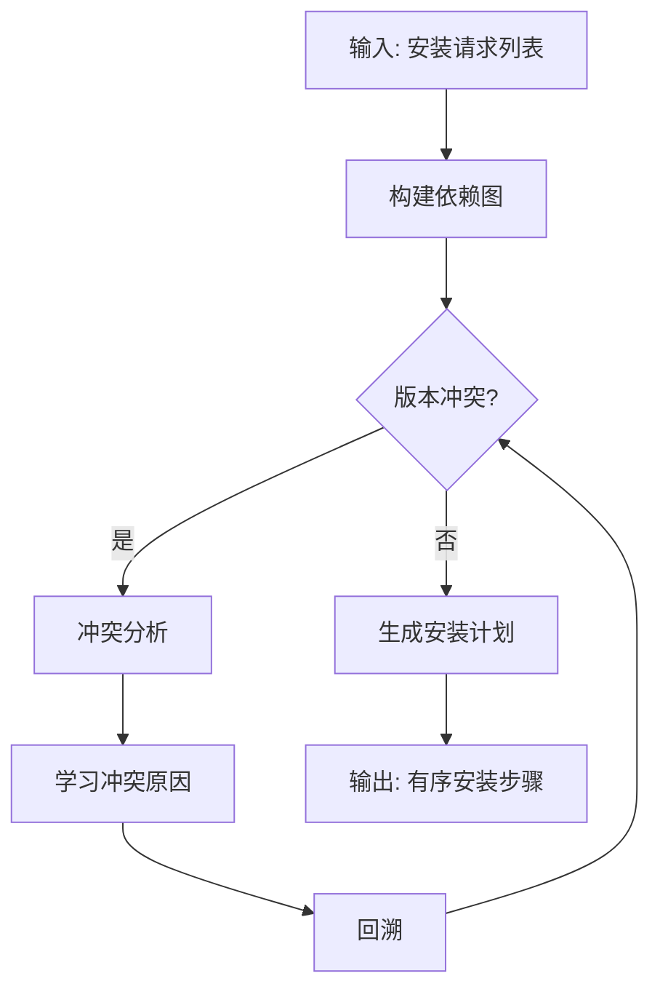
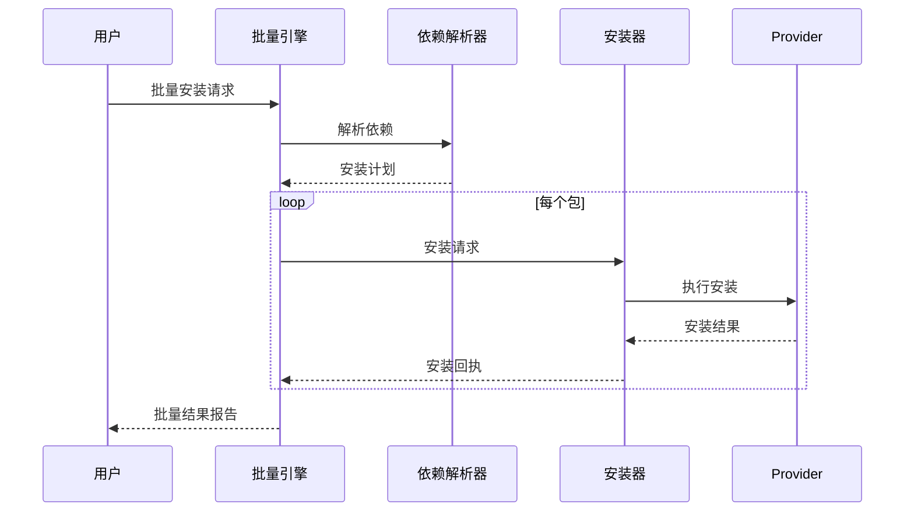
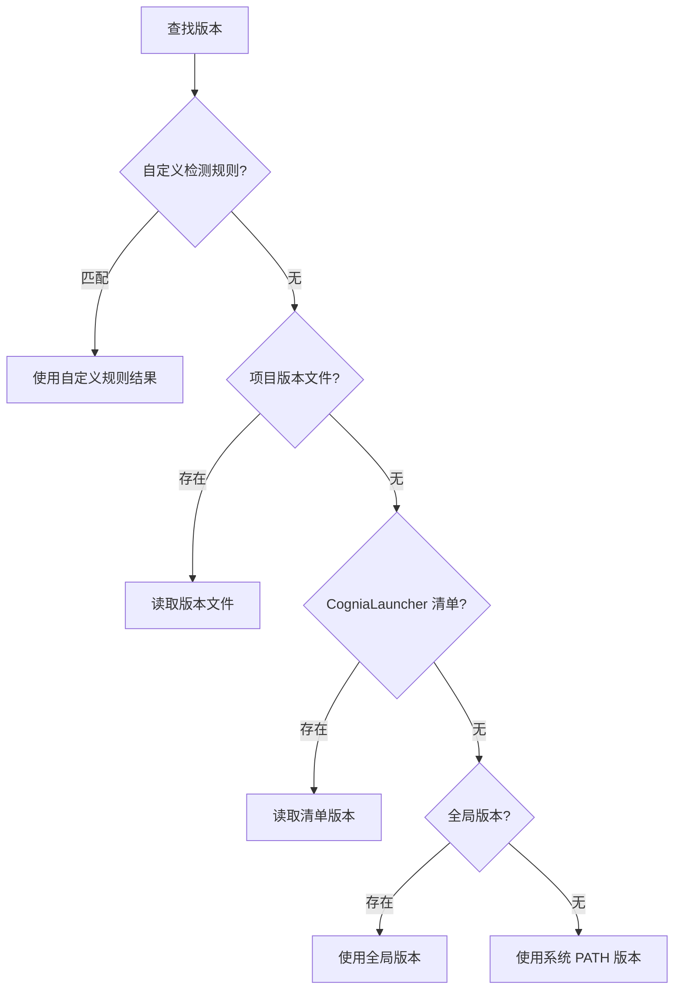
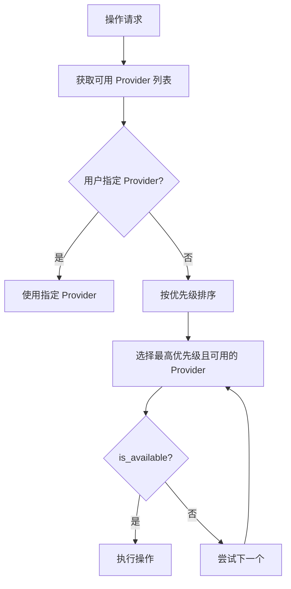

# 软件设计

本文档记录 CogniaLauncher 的核心设计思想和关键算法。

---

## 依赖解析算法

CogniaLauncher 使用 **PubGrub** 算法进行依赖解析：

### 核心特性

- **完整性** — 保证找到解或证明无解
- **增量式** — 逐步添加约束
- **冲突学习** — 避免重复探索相同冲突路径
- **人类可读错误** — 冲突时生成易理解的错误消息

---

## 安装编排

多包安装使用编排器（Orchestrator）协调：

### 安装顺序

1. 拓扑排序依赖图
2. 无依赖的包可并行安装
3. 有依赖的包按依赖顺序安装
4. 单个包失败不阻塞无关包

---

## 版本检测优先级

### 自定义检测

支持 9 种提取策略：

| 策略 | 描述 | 示例 |
|------|------|------|
| 正则表达式 | 从文本中提取 | `(\d+\.\d+\.\d+)` |
| JSON 路径 | 从 JSON 提取 | `$.engines.node` |
| TOML 字段 | 从 TOML 提取 | `tool.python.version` |
| YAML 路径 | 从 YAML 提取 | `runtime.version` |
| 行号 | 指定行提取 | 第 3 行 |
| 环境变量 | 读取环境变量 | `NODE_VERSION` |
| 命令输出 | 执行命令提取 | `node --version` |
| 文件名 | 从文件名提取 | `python-3.11.tar.gz` |
| 固定值 | 使用固定版本 | `20.0.0` |

---

## Provider 选择算法

当同一操作有多个可用 Provider 时的选择逻辑：

---

## 健康检查系统

健康检查系统诊断环境和系统问题：

1. **环境检查** — 版本文件一致性、PATH 配置
2. **系统检查** — 磁盘空间、网络连接
3. **Provider 检查** — Provider 可用性、配置正确性
4. **修复建议** — 针对每个问题生成修复操作

---

## 配置快照（Profiles）

Profiles 系统管理环境配置快照：

- **创建快照** — 记录当前所有环境版本
- **恢复快照** — 批量切换到快照中的版本
- **导出/导入** — 跨机器共享环境配置
- **比较** — 对比两个快照的差异
